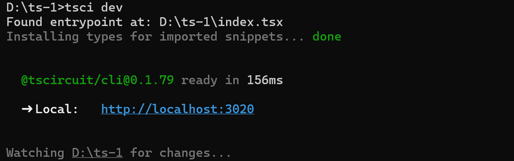
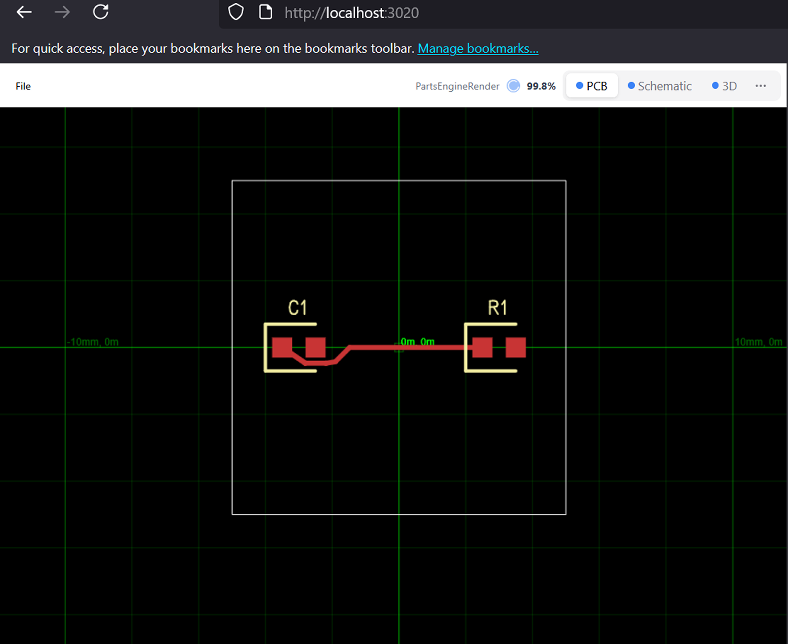

`tsci dev` runs a web server that lets you see a preview of your electronics
in your web browser.

After you run `tsci dev` you should see a preview of your entrypoint file in
your web browser on https://localhost:3020





## KiCad PCM Server

The `--kicad-pcm` flag starts a KiCad Plugin and Content Manager (PCM) server in
the background alongside the development server. This allows you to install your
tscircuit components directly into KiCad as a library.

```bash
tsci dev --kicad-pcm
```

Example output:

```
➜  library tsci dev --kicad-pcm
  @tscircuit/cli@0.1.851 ready in 1067ms

  ➜ Local:   http://localhost:3023/#file=lib%2Findex.ts

Watching "my-project" for changes...

  ➜ Auto-updating KiCad PCM Server: http://localhost:3023/pcm/repository.json
```

### Adding the PCM Repository to KiCad

To use your tscircuit components in KiCad:

1. Open KiCad and go to **Plugin and Content Manager**
2. Click **Manage Repositories**
3. Click the **Add** button (plus icon)
4. Enter the PCM URL shown in your terminal (e.g., `http://localhost:3023/pcm/repository.json`)
5. Click **OK** to save


Once added, your tscircuit library will appear in KiCad's Plugin and Content
Manager. The library automatically updates as you make changes to your tscircuit
project, so you can iterate on your designs without needing to re-export.
