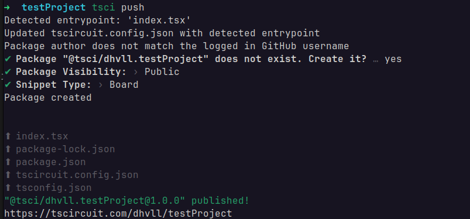

tscircuit code, like React code, is distributed as a "package". `tsci push` uploads your package to [tscircuit registry](https://tscircuit.com/trending) to enable sharing with your team.

After publishing, you can use the [tsci add](https://docs.tscircuit.com/command-line/tsci-add) command to install your package as part of a larger circuit.

After running `tsci push` you can see your package on your tscircuit registry page. Packages default to private visibility, but you can change this from your registry page to enable sharing your package with the broader ecosystem.

