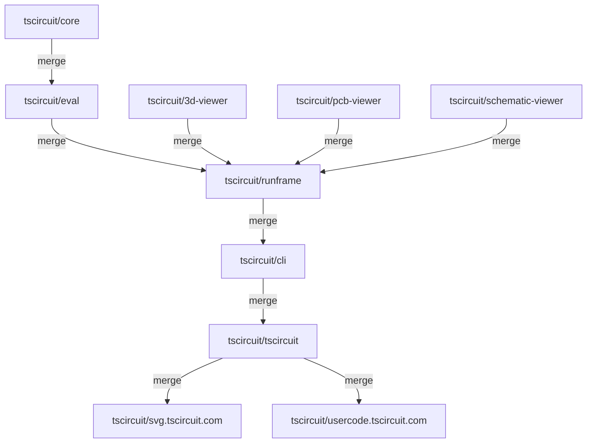

# Package Dependencies and Auto-Updates

The tscircuit ecosystem consists of multiple interconnected packages that automatically update each other when changes are merged. This guide explains the dependency chain and how the auto-update workflow functions.

## Package Dependency Flow

The following diagram shows how packages in the tscircuit ecosystem depend on and trigger updates to each other:

## Workflow Implementation

The auto-update system consists of two main components:

### 1. PR Creation Workflow
- Located in each upstream repository (e.g., `tscircuit/core`)
- Triggers when code is merged to main branch
- Creates a pull request in downstream repositories with dependency updates
- Uses `@tscircuitbot` to automate the process

### 2. Auto-Merge Workflow
- Located in each downstream repository (e.g., `tscircuit/eval`)
- Close all the old PR's created by the `@tscircuitbot` which failed to update the dependency
- Automatically merges PRs created by `@tscircuitbot`
- **Requires all tests to pass before merging**
- Prevents broken code from propagating through the dependency chain

## Key Design Principles

### No Circular Dependencies
The workflow is carefully designed to avoid circular dependencies:
- Updates flow in one direction only
- Each package has a clear position in the dependency hierarchy
- No package updates its own dependencies' dependencies

### Ploppable Workflow
The workflow is implemented as a standardized template via [tscircuit/plop](https://github.com/tscircuit/plop):
- Same workflow file works across all repositories
- Only minor customization needed (repository names)
- No fragile per-test configuration required
- Easy to maintain and deploy to new packages

### Test-Gated Merging
- Auto-merge only occurs when all tests pass
- Broken builds are prevented from propagating
- Manual intervention required if tests fail

## Troubleshooting

If the auto-update workflow fails:

1. **Check Test Status**: Ensure all tests pass in the target repository
2. **Review PR**: Check the auto-generated pull request for any conflicts
3. **Manual Intervention**: If auto-merge fails, manually review and merge the PR