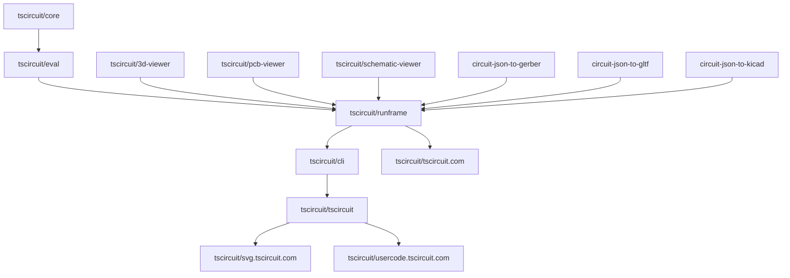

# Package Dependencies and Auto-Updates

The tscircuit ecosystem consists of multiple interconnected packages that automatically update each other when changes are merged. This guide explains the dependency chain and how the auto-update workflow functions.

## Package Dependency Flow

The following diagram shows how packages in the tscircuit ecosystem depend on and trigger updates to each other:

## Workflow Implementation

The auto-update system consists of coordinated workflows across multiple repositories. Here's how it works in detail:

## Adding Dependencies to the Automerge Pipeline

If dependencies frequently need to be updated and are relatively stable, they can be added to the automerge pipeline. To add a new dependency, follow this process:

1. Propose a change to the Mermaid diagram in [this doc on GitHub](https://github.com/tscircuit/docs/blob/main/docs/contributing/package-dependencies-and-auto-updates.mdx) to include the new package relationship.
2. Add a workflow dispatch from the [`bun-pver-release.yml` file](https://github.com/tscircuit/plop/blob/main/template-files/bun-pver-release.yml) for the repository that should trigger updates in downstream packages.
3. Use [`@tscircuit/plop`](https://github.com/tscircuit/plop) to add the [`update-package.yml`](https://github.com/tscircuit/plop/blob/main/template-files/update-package.yml) workflow to the target repository that should receive automated updates.
4. Monitor the automerge pipeline to confirm it correctly opens and closes PRs as updates are released.

### Example: `tscircuit/core` to `tscircuit/eval` Update Flow

**Step 1: Publish and Trigger (Upstream Repository)**
When a PR is merged to `tscircuit/core`, the [`bun-pver-release.yml`](https://github.com/tscircuit/plop/blob/main/template-files/bun-pver-release.yml) workflow:
- Builds and publishes the new package version to npm using `pver release`
- Triggers a `workflow_dispatch` event to downstream repositories like `tscircuit/eval`

**Step 2: Update Dependencies (Downstream Repository)**
The [`update-package.yml`](https://github.com/tscircuit/plop/blob/main/template-files/update-package.yml) workflow in `tscircuit/eval`:
- Receives the dispatch with package names to update (e.g., `@tscircuit/core`)
- Runs `bun update --latest` for each specified package
- Closes any existing update PRs from `@tscircuitbot` to avoid conflicts
- Creates a new PR with the updated dependencies and enables auto-merge

**Step 3: Auto-Merge Process**
After the PR is created:
- All CI tests and checks must pass
- If tests pass, the PR automatically merges
- The merge triggers the next workflow in the chain (eval → runframe)

## Key Design Principles

### No Circular Dependencies
The workflow is carefully designed to avoid circular dependencies:
- Updates flow in one direction only
- Each package has a clear position in the dependency hierarchy
- No package updates its own dependencies' dependencies

### Test-Gated Merging
- Auto-merge only occurs when all tests and CI checks pass
- Broken builds are prevented from propagating
- Manual intervention required if tests fail
