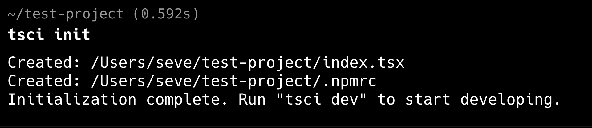
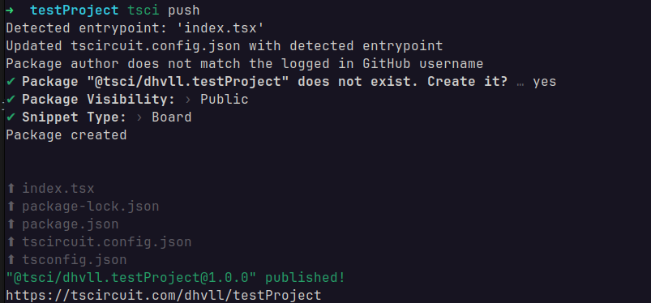
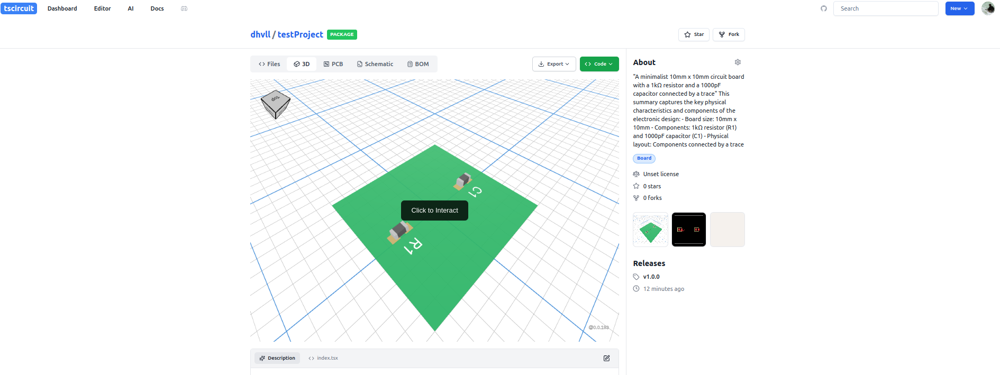

import YouTubeEmbed from '../../src/components/YouTubeEmbed';

## Overview

The command line is the best way to use tscircuit. Using the CLI, you can just
run `tsci dev` in a project and see previews of your circuit just like any
other local development tool!

<YouTubeEmbed youtubeId="faW4-M91rQQ" />

## Install the tscircuit CLI

You can install the tscircuit CLI by running `npm install -g @tscircuit/cli`.

## Create a new Project

First, create a new tscircuit project by running `tsci init`. This will create a new directory with all the necessary files to get started:

## Run the Development Server

Next, start the development server by running `tsci dev`. This will start a local server that automatically rebuilds your circuit when you make changes:

Go to https://localhost:3020. You can now see PCB, Schematic and 3D views of your circuit, which update in real-time as you make changes to your code.

## Pushing to the tscircuit Registry

<!-- TODO -->
Next, you push your project by running `tsci push`. This will push your project to your registry.

Go to your tscircuit account. You can now see PCB, Schematic and 3D views of your circuit in you registry. 

## Exporting to SVGs, PDF, or Fabrication Files

<!-- TODO -->

This section is coming soon!