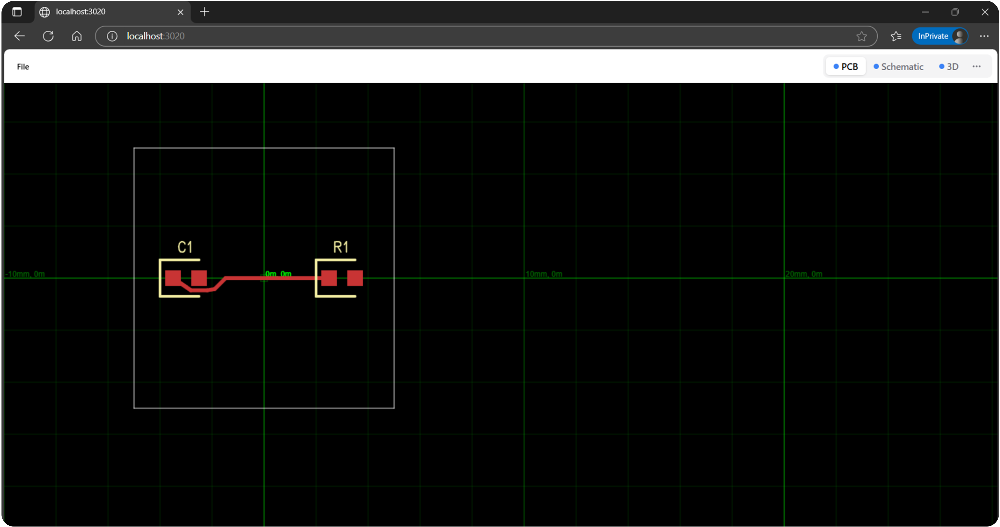
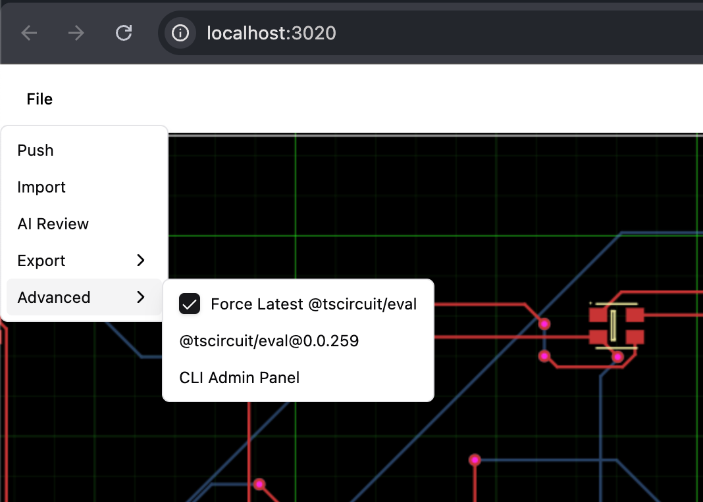
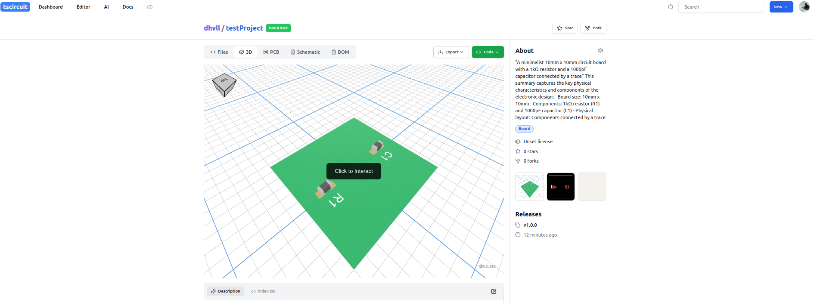

import Terminal from "@site/src/components/terminal"
import initTranscript from "@site/src/data/terminals/init.json"
import devTranscript from "@site/src/data/terminals/dev.json"
import pushTranscript from "@site/src/data/terminals/push.json"

import YouTubeEmbed from '../../src/components/YouTubeEmbed';

## Overview

Ask your AI to “use tscircuit to create a circuit project and start the preview.”
It can handle installation and run the CLI in environments with tool access.
The steps below explain how to do this yourself and refine the result.

<YouTubeEmbed youtubeId="faW4-M91rQQ" />

## Manual installation

You can install the tscircuit CLI by running `npm install -g tscircuit`.

## Create a new Project

First, create a new tscircuit project by running `tsci init`. This will create a new directory with all the necessary files to get started:

<Terminal {...initTranscript} />

## Run the Development Server

Next, start the development server by running `tsci dev`. This will start a local server that automatically rebuilds your circuit when you make changes:

<Terminal {...devTranscript} />

Go to http://localhost:3020. You can now see PCB, Schematic and 3D views of your circuit, which update in real-time as you make changes to your code.

### Using the CLI Offline

To use the CLI offline, you need to disable the "Force Latest @tscircuit/eval" option in the file menu. Click on "File" in the top menu, then uncheck the "Force Latest @tscircuit/eval" option:

## Pushing to the tscircuit Registry

<!-- TODO -->
Next, you push your project by running `tsci push`. This will push your project to your registry.
<Terminal {...pushTranscript} />

Go to your tscircuit account. You can now see PCB, Schematic and 3D views of your circuit in you registry. 

## Exporting to SVGs, PDF, or Fabrication Files

<!-- TODO -->

This section is coming soon!