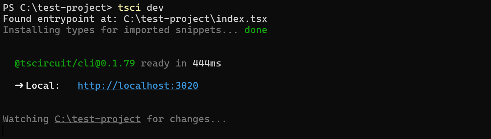
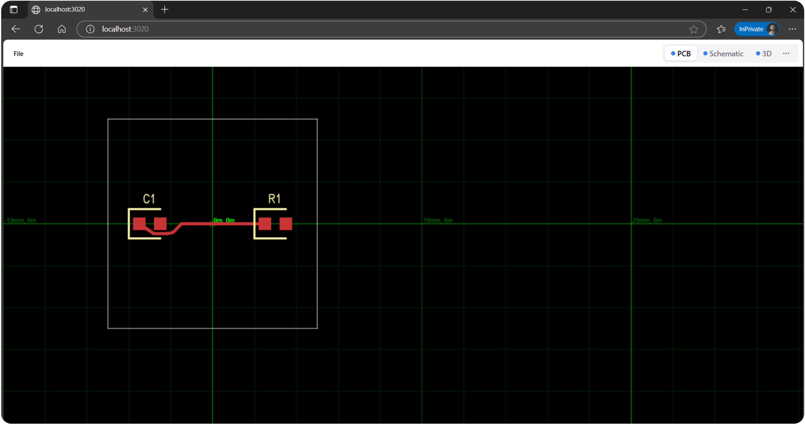

import CircuitPreview from '@site/src/components/CircuitPreview'; // Assuming you have this component
import { TscircuitIframe } from "../../src/components/TscircuitIframe" // Assuming you have this component

## Overview

This tutorial guides you through creating a custom mechanical keyboard PCB using tscircuit. We'll cover setting up your environment, understanding the core components, building a key matrix, creating a simple 4-key keyboard, and finally scaling up to a standard 60% layout using data from Keyboard Layout Editor.

We'll be using a Raspberry Pi Pico as the microcontroller, Kailh Choc-style key switches, and standard diodes for the matrix.

## 1. Set Up Your Environment

Before we start building, let's get your development environment ready.

### Prerequisites

You need [Node.js](https://nodejs.org/) or [Bun](https://bun.sh/) installed on your system.

### Install tscircuit CLI

Install the tscircuit command-line interface (CLI) globally using npm or bun:

```bash
npm install -g @tscircuit/cli
# or
bun install -g @tscircuit/cli
```

This installs the `tsci` command, which you can use to create, develop, and export tscircuit projects.

### Create a New Project

Navigate to where you want to create your project and run `tsci init`:

```bash
mkdir my-keyboard
cd my-keyboard
tsci init
```

This command bootstraps a new tscircuit project with a basic structure, including an `index.tsx` file (our main circuit definition), `package.json`, `tsconfig.json`, and other necessary configuration files.

### Run the Development Server

Start the tscircuit development server by running:

```bash
tsci dev
```

This command compiles your `index.tsx` file and serves it on `http://localhost:3020` (or the next available port). Open this URL in your browser. You should see a live preview of your circuit, including PCB, Schematic, and 3D views. The server watches for file changes and automatically updates the preview.





## 2. Import the Main Components

A keyboard PCB primarily consists of three types of components:

1.  **Microcontroller:** The "brain" that scans the keys and communicates with the computer. We'll use a Raspberry Pi Pico.
2.  **Key Switches:** The physical buttons you press. We'll use a generic Kailh Choc footprint component.
3.  **Diodes:** Prevent "ghosting" (incorrect key press readings) in the matrix.

Let's import these into our project.

First, you'll need to install the packages containing the Pico and Key components if you don't have them (the `tsci init` template might include some). We'll assume they are available via the `@tsci/seveibar` scope as shown in the provided `index.tsx`. If `tsci init` didn't add them, you might need:

```bash
# If using npm
npm install @tsci/seveibar.PICO @tsci/seveibar.Key

# If using bun
bun add @tsci/seveibar.PICO @tsci/seveibar.Key
```

Now, let's look at the code for importing and previewing each component.

### Microcontroller (Raspberry Pi Pico)

We import the `PICO` component. It provides the necessary footprint and pin definitions for the Raspberry Pi Pico.

```tsx title="index.tsx (partial)"
import { PICO } from "@tsci/seveibar.PICO";

export default () => (
  <board width="50mm" height="60mm">
    <PICO name="U1" />
  </board>
);
```

<CircuitPreview defaultView="pcb" code={`
import { PICO } from "@tsci/seveibar.PICO";

export default () => (
  <board width="50mm" height="60mm">
    <PICO name="U1" />
  </board>
);
`} />

### Key Switch (Kailh Choc Style)

We import a `Key` component, representing a single switch with its footprint.

```tsx title="index.tsx (partial)"
import { Key } from "@tsci/seveibar.Key";

export default () => (
  <board width="30mm" height="30mm">
    <Key name="K1" />
  </board>
);
```

<CircuitPreview defaultView="pcb" code={`
import { Key } from "@tsci/seveibar.Key";

export default () => (
  <board width="30mm" height="30mm">
    <Key name="K1" />
  </board>
);
`} />

### Diode (1N4148WS SMD)

We import the `A_1N4148WS` diode component, defined locally in our project (as seen in the provided `repomix-output.txt`). This SMD diode is suitable for keyboard matrices. Make sure the `imports/A1N4148WS.tsx` file exists in your project.

```tsx title="imports/A1N4148WS.tsx"
import type { ChipProps } from "@tscircuit/props"

const pinLabels = {
  pin1: ["C"], // Cathode
  pin2: ["A"], // Anode
} as const

export const A_1N4148WS = (props: ChipProps<typeof pinLabels>) => {
  return (
    <chip
      pinLabels={pinLabels}
      symbolName="diode"
      supplierPartNumbers={{
        jlcpcb: ["C57759"],
      }}
      manufacturerPartNumber="A_1N4148WS"
      footprint={
        <footprint>
          <smtpad
            portHints={["pin1"]} // Cathode
            pcbX="-1.1725910000000113mm"
            pcbY="0mm"
            width="0.9999979999999999mm"
            height="0.7500112mm"
            shape="rect"
          />
          <smtpad
            portHints={["pin2"]} // Anode
            pcbX="1.1725910000000113mm"
            pcbY="0mm"
            width="0.9999979999999999mm"
            height="0.7500112mm"
            shape="rect"
          />
          {/* Silkscreen omitted for brevity */}
        </footprint>
      }
      cadModel={{
        objUrl:
          "https://modelcdn.tscircuit.com/easyeda_models/download?uuid=973acf8a660c48b1975f1ba1c890421a&pn=C57759",
        rotationOffset: { x: 0, y: 0, z: 0 },
        positionOffset: { x: 0, y: 0, z: 0 },
      }}
      {...props}
    />
  )
}
```

```tsx title="index.tsx (partial)"
import { A_1N4148WS } from "./imports/A1N4148WS";

export default () => (
  <board width="20mm" height="20mm">
    <A_1N4148WS name="D1" />
  </board>
);
```

<CircuitPreview defaultView="pcb" code={`
import { A_1N4148WS } from "./imports/A1N4148WS";

export default () => (
  <board width="20mm" height="20mm">
    <A_1N4148WS name="D1" />
  </board>
);
`} />

## 3. Create the KeyMatrix Component

Connecting each key switch directly to the microcontroller would require a large number of pins, especially for full-size keyboards. Instead, keyboards use a **matrix scanning** technique.

### How Matrix Scanning Works

1.  **Grid Layout:** Keys are arranged logically in a grid of rows and columns.
2.  **Connections:** Each key switch connects a specific row wire to a specific column wire when pressed.
3.  **Scanning:** The microcontroller activates one row (or column) at a time and checks which columns (or rows) become active. This identifies the pressed key(s) at the intersection.
4.  **Diodes:** A diode is placed in series with each switch. This prevents "ghosting," where pressing multiple keys simultaneously might falsely register additional key presses. The diode ensures current flows only in one direction (typically from column to row, or vice-versa depending on the scanning direction).

### The `KeyMatrix` Component

Let's create a reusable React component, `KeyMatrix`, that takes a keyboard layout definition and pin mappings, then generates the grid of keys and diodes.

We'll need helper functions to parse the layout data (from Keyboard Layout Editor format) and generate reference designators for each key.

First, the helper to generate reference designators based on key labels:

```tsx title="lib/getRefDesForKey.tsx"
const refDesMap = {
  "~": "K_TILDE",
  "~`": "K_TILDE",
  "!": "K_EXCLAMATION",
  "@": "K_AT",
  "#": "K_HASH",
  $: "K_DOLLAR",
  "%": "K_PERCENT",
  "^": "K_CARET",
  "&": "K_AMPERSAND",
  "*": "K_ASTERISK",
  "(": "K_LPAREN",
  ")": "K_RPAREN",
  "{": "K_LBRACE",
  "}": "K_RBRACE",
  "|": "K_PIPE",
  "[": "K_LSQBRAK",
  "]": "K_RSQBRAK",
  '"': "K_QUOTE",
  "'": "K_SINGLEQUOTE",
  "<": "K_LT",
  ">": "K_GT",
  "?": "K_QUESTION",
  "/": "K_SLASH",
  windows: "K_WINDOWS",
  win: "K_WINDOWS",
  menu: "K_MENU",
  "caps lock": "K_CAPSLOCK",
  ":": "K_COLON",
  ";": "K_SEMICOLON",
  "1": "K_N1",
  "2": "K_N2",
  "3": "K_N3",
  "4": "K_N4",
  "5": "K_N5",
  "6": "K_N6",
  "7": "K_N7",
  "8": "K_N8",
  "9": "K_N9",
  "0": "K_N0",
  "-": "K_MINUS",
  "+": "K_PLUS",
  backspace: "K_BACKSPACE",
  tab: "K_TAB",
  " ": "K_SPACE",
  enter: "K_ENTER",
  shift: "K_SHIFT",
  ctrl: "K_CTRL",
  alt: "K_ALT",
  escape: "K_ESCAPE",
  arrowleft: "K_ARROW_LEFT",
  arrowright: "K_ARROW_RIGHT",
  arrowup: "K_ARROW_UP",
  arrowdown: "K_ARROW_DOWN",
  backquote: "K_BACKQUOTE",
  quote: "K_QUOTE",
  semicolon: "K_SEMICOLON",
  comma: "K_COMMA",
  period: "K_PERIOD",
  slash: "K_SLASH",
  backslash: "K_BACKSLASH",
  bracketleft: "K_BRACKET_LEFT",
  bracketright: "K_BRACKET_RIGHT",
  a: "K_A",
  b: "K_B",
  c: "K_C",
  d: "K_D",
  e: "K_E",
  f: "K_F",
  g: "K_G",
  h: "K_H",
  i: "K_I",
  j: "K_J",
  k: "K_K",
  l: "K_L",
  m: "K_M",
  n: "K_N",
  o: "K_O",
  p: "K_P",
  q: "K_Q",
  r: "K_R",
  s: "K_S",
  t: "K_T",
  u: "K_U",
  v: "K_V",
  w: "K_W",
  x: "K_X",
  y: "K_Y",
  z: "K_Z",
}
export const getRefDesForKey = (key: string): string => {
  const normKeyLabels = key.toLowerCase().split("\n")
  for (const normKeyLabel of normKeyLabels) {
    if (normKeyLabel in refDesMap) {
      return refDesMap[normKeyLabel as keyof typeof refDesMap]
    }
  }
  if (key === "") {
    return "K_SPACE"
  }
  if (key.match(/^[a-zA-Z0-9]+$/)) {
    return `K_${key.toUpperCase()}`
  }
  throw new Error(`No defined refDes for key "${key}"`)
}
```

Next, the layout parser:

```tsx title="lib/KLELayout.tsx"
import { getRefDesForKey } from "./getRefDesForKey"; // Corrected import path

export type KLEKey =
  | string
  | {
      x?: number
      y?: number
      w?: number
      h?: number
      x2?: number
      y2?: number
      w2?: number
      h2?: number
      r?: number
      rx?: number
      ry?: number
      n?: boolean
      l?: boolean
      d?: boolean
      g?: boolean
      sm?: string
      sb?: string
      st?: string
      a?: number
    }

export type KLELayout = KLEKey[][]

export const parseKLELayout = (layout: KLELayout) => {
  const KEY_SIZE = 19.05 // Standard keycap size (19.05mm or 0.75 inches)
  const keys: Array<{
    name: string
    x: number
    y: number
    width: number
    height: number
    rotation: number
    rotationX: number
    rotationY: number
    row: number
    col: number
  }> = []

  let currentX = 0
  let currentY = 0
  let currentRotation = 0
  let currentRotationX = 0
  let currentRotationY = 0

  // Default properties for keys
  let currentProps = {
    width: 1,
    height: 1,
    x: 0,
    y: 0,
    align: undefined as undefined | number,
  }

  const nameCounters = new Map<string, number>()
  layout.forEach((row, rowIndex) => {
    currentX = 0
    let colIndex = 0

    row.forEach((item) => {
      if (typeof item === "object") {
        if (item.x !== undefined) currentX += item.x
        if (item.y !== undefined) currentY += item.y
        if (item.w !== undefined) currentProps.width = item.w
        if (item.h !== undefined) currentProps.height = item.h
        if (item.r !== undefined) currentRotation = item.r
        if (item.rx !== undefined) currentRotationX = item.rx
        if (item.ry !== undefined) currentRotationY = item.ry
        if (item.a !== undefined) currentProps.align = item.a
      } else if (typeof item === "string") {
        let refDes = getRefDesForKey(item);
        const baseRefDes = refDes; // Store original refDes before appending counter

        if (nameCounters.has(baseRefDes)) {
          const count = nameCounters.get(baseRefDes)!;
          // If the original key exists and doesn't have a counter suffix, update it
          const ogKey = keys.find((k) => k.name === baseRefDes);
          if (ogKey && !ogKey.name.match(/\d+$/)) {
             ogKey.name = `${baseRefDes}1`; // Assuming first one becomes '1'
          }

          // Increment counter and set new refDes
          nameCounters.set(baseRefDes, count + 1);
          refDes = `${baseRefDes}${count + 1}`;
        } else {
          nameCounters.set(baseRefDes, 1);
          // Don't append '1' if it's the first instance, unless needed later
        }


        keys.push({
          name: refDes,
          x: (currentX + currentProps.width / 2) * KEY_SIZE,
          y: -(currentY + currentProps.height / 2) * KEY_SIZE, // Invert Y for PCB coordinates
          width: currentProps.width * KEY_SIZE,
          height: currentProps.height * KEY_SIZE,
          rotation: currentRotation,
          rotationX: currentRotationX * KEY_SIZE,
          rotationY: currentRotationY * KEY_SIZE,
          row: rowIndex,
          col: colIndex,
        })

        currentX += currentProps.width
        colIndex++

        currentProps.width = 1
        currentProps.height = 1
      }
    })
    currentY++
  })

  // Final pass to ensure keys with the same base name have counters if needed
  const finalNameCounts = new Map<string, number>();
  keys.forEach(key => {
    const baseNameMatch = key.name.match(/^([A-Z_]+)/);
    if (baseNameMatch) {
        const baseName = baseNameMatch[1];
        finalNameCounts.set(baseName, (finalNameCounts.get(baseName) || 0) + 1);
    }
  });

  keys.forEach(key => {
     const baseNameMatch = key.name.match(/^([A-Z_]+)(\d*)$/);
     if (baseNameMatch) {
         const baseName = baseNameMatch[1];
         const numSuffix = baseNameMatch[2];
         if (finalNameCounts.get(baseName)! > 1 && numSuffix === "") {
             // If there are multiple keys with this base name, and this one doesn't have a suffix,
             // assume it's the first one and add '1'. This relies on the initial pass logic.
             // A more robust solution might require re-numbering all duplicates.
             // For simplicity, we'll stick to the logic inferred from the provided code.
             // The original code seems to handle this by potentially renaming the *first*
             // instance when a *second* one is encountered. Let's replicate that nuance.
             // The provided code snippet's name counting logic was slightly ambiguous
             // on exactly *when* the first item gets renamed. Assuming it happens
             // when the second is added.
         }
     }
  });


  return keys
}
```

Finally, the `KeyMatrix` component itself:

```tsx title="lib/KeyMatrix.tsx"
import { Key } from "@tsci/seveibar.Key";
import { parseKLELayout, type KLELayout } from "./KLELayout"; // Corrected import path
import { A_1N4148WS } from "../imports/A1N4148WS"; // Corrected import path

interface KeyMatrixProps {
  layout: KLELayout
  rowToMicroPin?: string[] // Array mapping row index to net name (e.g., "net.ROW0")
  colToMicroPin?: string[] // Array mapping col index to net name (e.g., "net.COL0")
  name?: string
  pcbX?: number
  pcbY?: number
  schX?: number
  schY?: number
}

export const KeyMatrix = ({
  layout,
  rowToMicroPin,
  colToMicroPin,
  name = "KB",
  pcbX = 0,
  pcbY = 0,
  schX = 0,
  schY = 0,
}: KeyMatrixProps) => {
  const keys = parseKLELayout(layout)

  // Calculate keyboard bounding box to center it
  const minX = Math.min(...keys.map((k) => k.x - k.width / 2))
  const maxX = Math.max(...keys.map((k) => k.x + k.width / 2))
  const minY = Math.min(...keys.map((k) => k.y - k.height / 2))
  const maxY = Math.max(...keys.map((k) => k.y + k.height / 2))
  const centerX = (minX + maxX) / 2;
  const centerY = (minY + maxY) / 2;


  return (
    <group name={name} pcbX={pcbX} pcbY={pcbY} schX={schX} schY={schY}>
      {keys.map((key) => {
        // Calculate the relative position from the center of the keyboard
        const relX = key.x - centerX;
        const relY = key.y - centerY;

        const rowNet = rowToMicroPin?.[key.row];
        const colNet = colToMicroPin?.[key.col];

        // Diode: Anode (A/pin2) -> Key Pin 1, Cathode (C/pin1) -> Row Net
        // Key: Pin 1 -> Diode Anode, Pin 2 -> Column Net

        return (
          <group
            key={key.name}
            // Position the group containing the key and diode
            pcbX={relX}
            pcbY={relY}
            // Adjust schematic positions for better layout
            schX={relX / 10} // Scale down schematic positions
            schY={relY / 10}
          >
            <Key name={key.name} />
            {rowNet !== undefined && (
              <A_1N4148WS
                name={`${key.name}_DIO`}
                connections={{
                  pin2: `.${key.name} .pin1`, // Diode Anode (A) connects to Key pin 1
                  pin1: rowNet,              // Diode Cathode (C) connects to Row net
                }}
                // Position diode relative to the key
                pcbX={0} // Adjust as needed for PCB layout
                pcbY={-7} // Place diode slightly below the key center
                schY={-1} // Place diode below key in schematic
                layer="bottom" // Place diode on the bottom layer
              />
            )}
            {colNet !== undefined && (
              <trace from={`.${key.name} .pin2`} to={colNet} /> // Key pin 2 connects to Col net
            )}
          </group>
        )
      })}
    </group>
  )
}
```

This component:
1. Parses the `layout` using `parseKLELayout`.
2. Calculates the center of the keyboard for relative positioning.
3. Iterates through each `key` definition from the parsed layout.
4. For each key, it creates a `<group>` to hold the key switch and its diode.
5. Places the `<Key>` component.
6. If `rowToMicroPin` is provided for the key's row, it places an `A_1N4148WS` diode:
    * The diode's **Anode (A/pin2)** connects to the **Key's pin1**.
    * The diode's **Cathode (C/pin1)** connects to the corresponding **row net**.
    * The diode is placed slightly below the key on the PCB's **bottom layer**.
7. If `colToMicroPin` is provided for the key's column, it creates a `<trace>` connecting the **Key's pin2** to the corresponding **column net**.
8. Positions the key groups relative to the keyboard's center.

## 4. Create a Basic 4-Key Keyboard

Now, let's use our `KeyMatrix` component to create a simple 2x2 keyboard.

We'll define the layout directly in our `index.tsx` and map the rows/columns to Pico pins.

```tsx title="index.tsx"
import { PICO } from "@tsci/seveibar.PICO";
import { KeyMatrix } from "./lib/KeyMatrix"; // Assuming KeyMatrix is in lib/
import type { KLELayout } from "./lib/KLELayout"; // Assuming KLELayout types are in lib/

// Define a simple 2x2 layout
const simpleLayout: KLELayout = [
  ["1", "2"],
  ["3", "4"],
];

// Map rows and columns to Pico pins (using net names for clarity)
const rowPins = ["net.ROW0", "net.ROW1"];
const colPins = ["net.COL0", "net.COL1"];

export default () => (
  <board width="60mm" height="60mm">
    {/* Place the Pico */}
    <PICO
      name="U1"
      pcbX={-25} // Position Pico to the left
      pcbRotation="90deg"
      connections={{
        // Connect Pico pins to our row/column nets
        GP15: rowPins[0], // Row 0
        GP16: rowPins[1], // Row 1
        GP0: colPins[0],  // Col 0
        GP1: colPins[1],  // Col 1
        // Add Ground connections for Pico
        GND1: "net.GND",
        GND2: "net.GND",
        GND3: "net.GND",
        GND4: "net.GND",
        GND5: "net.GND",
        GND6: "net.GND",
        GND7: "net.GND",
      }}
    />

    {/* Place the KeyMatrix */}
    <KeyMatrix
      layout={simpleLayout}
      rowToMicroPin={rowPins}
      colToMicroPin={colPins}
      pcbX={15} // Position matrix to the right
    />
  </board>
);
```

<CircuitPreview defaultView="pcb" code={`
import { PICO } from "@tsci/seveibar.PICO";
import { KeyMatrix } from "./lib/KeyMatrix"; // Assuming KeyMatrix is in lib/
import type { KLELayout } from "./lib/KLELayout"; // Assuming KLELayout types are in lib/
import { Key } from "@tsci/seveibar.Key"; // Need Key for KeyMatrix
import { A_1N4148WS } from "./imports/A1N4148WS"; // Need Diode for KeyMatrix
import { parseKLELayout } from "./lib/KLELayout"; // Need parser for KeyMatrix
import { getRefDesForKey } from "./lib/getRefDesForKey"; // Need refdes for parser

// --- Re-including component definitions needed by CircuitPreview ---
// Note: In a real project these are imported, not redefined.

const refDesMap = {
  "~": "K_TILDE", "~`": "K_TILDE", "!": "K_EXCLAMATION", "@": "K_AT", "#": "K_HASH", $: "K_DOLLAR", "%": "K_PERCENT", "^": "K_CARET", "&": "K_AMPERSAND", "*": "K_ASTERISK", "(": "K_LPAREN", ")": "K_RPAREN", "{": "K_LBRACE", "}": "K_RBRACE", "|": "K_PIPE", "[": "K_LSQBRAK", "]": "K_RSQBRAK", '"': "K_QUOTE", "'": "K_SINGLEQUOTE", "<": "K_LT", ">": "K_GT", "?": "K_QUESTION", "/": "K_SLASH", windows: "K_WINDOWS", win: "K_WINDOWS", menu: "K_MENU", "caps lock": "K_CAPSLOCK", ":": "K_COLON", ";": "K_SEMICOLON", "1": "K_N1", "2": "K_N2", "3": "K_N3", "4": "K_N4", "5": "K_N5", "6": "K_N6", "7": "K_N7", "8": "K_N8", "9": "K_N9", "0": "K_N0", "-": "K_MINUS", "+": "K_PLUS", backspace: "K_BACKSPACE", tab: "K_TAB", " ": "K_SPACE", enter: "K_ENTER", shift: "K_SHIFT", ctrl: "K_CTRL", alt: "K_ALT", escape: "K_ESCAPE", arrowleft: "K_ARROW_LEFT", arrowright: "K_ARROW_RIGHT", arrowup: "K_ARROW_UP", arrowdown: "K_ARROW_DOWN", backquote: "K_BACKQUOTE", quote: "K_QUOTE", semicolon: "K_SEMICOLON", comma: "K_COMMA", period: "K_PERIOD", slash: "K_SLASH", backslash: "K_BACKSLASH", bracketleft: "K_BRACKET_LEFT", bracketright: "K_BRACKET_RIGHT", a: "K_A", b: "K_B", c: "K_C", d: "K_D", e: "K_E", f: "K_F", g: "K_G", h: "K_H", i: "K_I", j: "K_J", k: "K_K", l: "K_L", m: "K_M", n: "K_N", o: "K_O", p: "K_P", q: "K_Q", r: "K_R", s: "K_S", t: "K_T", u: "K_U", v: "K_V", w: "K_W", x: "K_X", y: "K_Y", z: "K_Z",
};
const getRefDesForKey = (key) => { /* ... full implementation ... */
  const normKeyLabels = key.toLowerCase().split("\\n");
  for (const normKeyLabel of normKeyLabels) { if (normKeyLabel in refDesMap) { return refDesMap[normKeyLabel]; } }
  if (key === "") { return "K_SPACE"; }
  if (key.match(/^[a-zA-Z0-9]+$/)) { return \`K_\${key.toUpperCase()}\`; }
  throw new Error(\`No defined refDes for key "\${key}"\`);
};

const parseKLELayout = (layout) => { /* ... full implementation ... */
  const KEY_SIZE=19.05; const keys=[]; let currentX=0; let currentY=0; let currentRotation=0; let currentRotationX=0; let currentRotationY=0; let currentProps={width:1,height:1,x:0,y:0,align:undefined}; const nameCounters=new Map(); layout.forEach((row,rowIndex)=>{ currentX=0; let colIndex=0; row.forEach((item)=>{ if(typeof item==="object"){ if(item.x!==undefined)currentX+=item.x; if(item.y!==undefined)currentY+=item.y; if(item.w!==undefined)currentProps.width=item.w; if(item.h!==undefined)currentProps.height=item.h; if(item.r!==undefined)currentRotation=item.r; if(item.rx!==undefined)currentRotationX=item.rx; if(item.ry!==undefined)currentRotationY=item.ry; if(item.a!==undefined)currentProps.align=item.a }else if(typeof item==="string"){ let refDes=getRefDesForKey(item); const baseRefDes=refDes; if(nameCounters.has(baseRefDes)){ const count=nameCounters.get(baseRefDes); const ogKey=keys.find((k)=>k.name===baseRefDes); if(ogKey&&!ogKey.name.match(/\\d+$/)){ ogKey.name=\`\${baseRefDes}1\` } nameCounters.set(baseRefDes,count+1); refDes=\`\${baseRefDes}\${count+1}` }else{ nameCounters.set(baseRefDes,1) } keys.push({name:refDes,x:(currentX+currentProps.width/2)*KEY_SIZE,y:-(currentY+currentProps.height/2)*KEY_SIZE,width:currentProps.width*KEY_SIZE,height:currentProps.height*KEY_SIZE,rotation:currentRotation,rotationX:currentRotationX*KEY_SIZE,rotationY:currentRotationY*KEY_SIZE,row:rowIndex,col:colIndex}); currentX+=currentProps.width; colIndex++; currentProps.width=1; currentProps.height=1 } }); currentY++ }); return keys;
};

const KeyMatrix = ({ layout, rowToMicroPin, colToMicroPin, name="KB", pcbX=0, pcbY=0, schX=0, schY=0 }) => { /* ... full implementation ... */
  const keys=parseKLELayout(layout); const minX=Math.min(...keys.map((k)=>k.x-k.width/2)); const maxX=Math.max(...keys.map((k)=>k.x+k.width/2)); const minY=Math.min(...keys.map((k)=>k.y-k.height/2)); const maxY=Math.max(...keys.map((k)=>k.y+k.height/2)); const centerX=(minX+maxX)/2; const centerY=(minY+maxY)/2; return(<group name={name} pcbX={pcbX} pcbY={pcbY} schX={schX} schY={schY}> {keys.map((key)=>{ const relX=key.x-centerX; const relY=key.y-centerY; const rowNet=rowToMicroPin?.[key.row]; const colNet=colToMicroPin?.[key.col]; return(<group key={key.name} pcbX={relX} pcbY={relY} schX={relX/10} schY={relY/10}> <Key name={key.name} /> {rowNet!==undefined&&(<A_1N4148WS name={\`\${key.name}_DIO\`} connections={{pin2: \`.\${key.name} .pin1\`, pin1:rowNet}} pcbX={0} pcbY={-7} schY={-1} layer="bottom" />)} {colNet!==undefined&&(<trace from={\`.\${key.name} .pin2\`} to={colNet} />)} </group>) })} </group>)
};

const diodePinLabels = { pin1: ["C"], pin2: ["A"] }
const A_1N4148WS = (props) => ( <chip pinLabels={diodePinLabels} symbolName="diode" supplierPartNumbers={{ jlcpcb: ["C57759"] }} manufacturerPartNumber="A_1N4148WS" footprint={<footprint><smtpad portHints={["pin1"]} pcbX="-1.17mm" pcbY="0mm" width="1mm" height="0.75mm" shape="rect" /><smtpad portHints={["pin2"]} pcbX="1.17mm" pcbY="0mm" width="1mm" height="0.75mm" shape="rect" /></footprint>} {...props} /> );

// --- End Re-included definitions ---


// Define a simple 2x2 layout
const simpleLayout = [
  ["1", "2"],
  ["3", "4"],
];

// Map rows and columns to Pico pins (using net names for clarity)
const rowPins = ["net.ROW0", "net.ROW1"];
const colPins = ["net.COL0", "net.COL1"];

export default () => (
  <board width="60mm" height="60mm">
    {/* Place the Pico */}
    <PICO
      name="U1"
      pcbX={-25} // Position Pico to the left
      pcbRotation="90deg"
      connections={{
        // Connect Pico pins to our row/column nets
        GP15: rowPins[0], // Row 0
        GP16: rowPins[1], // Row 1
        GP0: colPins[0],  // Col 0
        GP1: colPins[1],  // Col 1
        // Add Ground connections for Pico
        GND1: "net.GND", GND2: "net.GND", GND3: "net.GND", GND4: "net.GND",
        GND5: "net.GND", GND6: "net.GND", GND7: "net.GND",
      }}
    />

    {/* Place the KeyMatrix */}
    <KeyMatrix
      layout={simpleLayout}
      rowToMicroPin={rowPins}
      colToMicroPin={colPins}
      pcbX={15} // Position matrix to the right
    />
  </board>
);

`} />

You now have a functional 4-key macropad PCB design!

## 5. Import a Standard Layout (60% Keyboard)

Manually defining layouts for larger keyboards is tedious. We can use data directly from [Keyboard Layout Editor](http://www.keyboard-layout-editor.com/). This website allows you to design layouts graphically and export them as JSON data, which matches our `KLELayout` type.

Let's use the `default60` layout provided in the `repomix-output.txt`. Create this file:

```tsx title="keyboard-layouts/default60.tsx"
export const default60 = [
  [
    "~\n`", "!\n1", "@\n2", "#\n3", "$\n4", "%\n5", "^\n6", "&\n7", "*\n8", "(\n9", ")\n0", "_\n-", "+\n=", { w: 2 }, "Backspace",
  ],
  [
    { w: 1.5 }, "Tab", "Q", "W", "E", "R", "T", "Y", "U", "I", "O", "P", "{\n[", "}\n]", { w: 1.5 }, "|\n\\",
  ],
  [
    { w: 1.75 }, "Caps Lock", "A", "S", "D", "F", "G", "H", "J", "K", "L", ":\n;", "\"\n'", { w: 2.25 }, "Enter",
  ],
  [
    { w: 2.25 }, "Shift", "Z", "X", "C", "V", "B", "N", "M", "<\n,", ">\n.", "?\n/", { w: 2.75 }, "Shift",
  ],
  [
    { w: 1.25 }, "Ctrl", { w: 1.25 }, "Win", { w: 1.25 }, "Alt", { a: 7, w: 6.25 }, "", { a: 4, w: 1.25 }, "Alt", { w: 1.25 }, "Win", { w: 1.25 }, "Menu", { w: 1.25 }, "Ctrl",
  ],
];
```

Now, update `index.tsx` to use this layout. We also need to expand our `rowPins` and `colPins` to match the requirements of a 60% keyboard (typically 5 rows and up to 15 columns). We'll use the pin assignments from the `repomix-output.txt` `index.tsx` example.

```tsx title="index.tsx (Updated for 60%)"
import { PICO } from "@tsci/seveibar.PICO";
import { KeyMatrix } from "./lib/KeyMatrix";
import type { KLELayout } from "./lib/KLELayout";
import { default60 } from "./keyboard-layouts/default60"; // Import the 60% layout

// Define row and column nets needed for a 60% layout
const rowPins = [
  "net.ROW0", // Note: Pin names adjusted for clarity, map starts from 0
  "net.ROW1",
  "net.ROW2",
  "net.ROW3",
  "net.ROW4",
];
const colPins = [
  "net.COL0", "net.COL1", "net.COL2", "net.COL3", "net.COL4",
  "net.COL5", "net.COL6", "net.COL7", "net.COL8", "net.COL9",
  "net.COL10", "net.COL11", "net.COL12", "net.COL13", "net.COL14",
];


export default () => (
  <board width="300mm" height="120mm"> {/* Increased board size */}
    {/* Place the Pico */}
    <PICO
      name="U1"
      pcbRotation="-90deg" // Rotate Pico for better placement
      pcbX={-130}          // Position Pico far left
      pcbY={0}
      connections={{
        // Map Pico pins to rows (GP15-GP19)
        GP15: rowPins[0], // Row 0
        GP16: rowPins[1], // Row 1
        GP17: rowPins[2], // Row 2
        GP18: rowPins[3], // Row 3
        GP19: rowPins[4], // Row 4
        // Map Pico pins to columns (GP0-GP14)
        GP0: colPins[0], GP1: colPins[1], GP2: colPins[2], GP3: colPins[3], GP4: colPins[4],
        GP5: colPins[5], GP6: colPins[6], GP7: colPins[7], GP8: colPins[8], GP9: colPins[9],
        GP10: colPins[10], GP11: colPins[11], GP12: colPins[12], GP13: colPins[13], GP14: colPins[14],
        // Add Ground connections
        GND1: "net.GND", GND2: "net.GND", GND3: "net.GND", GND4: "net.GND",
        GND5: "net.GND", GND6: "net.GND", GND7: "net.GND",
      }}
    />

    {/* Place the KeyMatrix using the default60 layout */}
    <KeyMatrix
      layout={default60}
      rowToMicroPin={rowPins}
      colToMicroPin={colPins}
      pcbX={0} // Center the keyboard matrix
      pcbY={0}
    />
  </board>
);
```

<CircuitPreview defaultView="pcb" code={`
import { PICO } from "@tsci/seveibar.PICO";
import { KeyMatrix } from "./lib/KeyMatrix";
import type { KLELayout } from "./lib/KLELayout";
import { default60 } from "./keyboard-layouts/default60";
import { Key } from "@tsci/seveibar.Key"; // Need Key for KeyMatrix
import { A_1N4148WS } from "./imports/A1N4148WS"; // Need Diode for KeyMatrix
import { parseKLELayout } from "./lib/KLELayout"; // Need parser for KeyMatrix
import { getRefDesForKey } from "./lib/getRefDesForKey"; // Need refdes for parser

// --- Re-including component definitions needed by CircuitPreview ---
// Note: In a real project these are imported, not redefined.

const refDesMap = {
  "~": "K_TILDE", "~`": "K_TILDE", "!": "K_EXCLAMATION", "@": "K_AT", "#": "K_HASH", $: "K_DOLLAR", "%": "K_PERCENT", "^": "K_CARET", "&": "K_AMPERSAND", "*": "K_ASTERISK", "(": "K_LPAREN", ")": "K_RPAREN", "{": "K_LBRACE", "}": "K_RBRACE", "|": "K_PIPE", "[": "K_LSQBRAK", "]": "K_RSQBRAK", '"': "K_QUOTE", "'": "K_SINGLEQUOTE", "<": "K_LT", ">": "K_GT", "?": "K_QUESTION", "/": "K_SLASH", windows: "K_WINDOWS", win: "K_WINDOWS", menu: "K_MENU", "caps lock": "K_CAPSLOCK", ":": "K_COLON", ";": "K_SEMICOLON", "1": "K_N1", "2": "K_N2", "3": "K_N3", "4": "K_N4", "5": "K_N5", "6": "K_N6", "7": "K_N7", "8": "K_N8", "9": "K_N9", "0": "K_N0", "-": "K_MINUS", "+": "K_PLUS", backspace: "K_BACKSPACE", tab: "K_TAB", " ": "K_SPACE", enter: "K_ENTER", shift: "K_SHIFT", ctrl: "K_CTRL", alt: "K_ALT", escape: "K_ESCAPE", arrowleft: "K_ARROW_LEFT", arrowright: "K_ARROW_RIGHT", arrowup: "K_ARROW_UP", arrowdown: "K_ARROW_DOWN", backquote: "K_BACKQUOTE", quote: "K_QUOTE", semicolon: "K_SEMICOLON", comma: "K_COMMA", period: "K_PERIOD", slash: "K_SLASH", backslash: "K_BACKSLASH", bracketleft: "K_BRACKET_LEFT", bracketright: "K_BRACKET_RIGHT", a: "K_A", b: "K_B", c: "K_C", d: "K_D", e: "K_E", f: "K_F", g: "K_G", h: "K_H", i: "K_I", j: "K_J", k: "K_K", l: "K_L", m: "K_M", n: "K_N", o: "K_O", p: "K_P", q: "K_Q", r: "K_R", s: "K_S", t: "K_T", u: "K_U", v: "K_V", w: "K_W", x: "K_X", y: "K_Y", z: "K_Z",
};
const getRefDesForKey = (key) => { /* ... full implementation ... */
  const normKeyLabels = key.toLowerCase().split("\\n");
  for (const normKeyLabel of normKeyLabels) { if (normKeyLabel in refDesMap) { return refDesMap[normKeyLabel]; } }
  if (key === "") { return "K_SPACE"; }
  if (key.match(/^[a-zA-Z0-9]+$/)) { return \`K_\${key.toUpperCase()}\`; }
  throw new Error(\`No defined refDes for key "\${key}"\`);
};

const parseKLELayout = (layout) => { /* ... full implementation ... */
  const KEY_SIZE=19.05; const keys=[]; let currentX=0; let currentY=0; let currentRotation=0; let currentRotationX=0; let currentRotationY=0; let currentProps={width:1,height:1,x:0,y:0,align:undefined}; const nameCounters=new Map(); layout.forEach((row,rowIndex)=>{ currentX=0; let colIndex=0; row.forEach((item)=>{ if(typeof item==="object"){ if(item.x!==undefined)currentX+=item.x; if(item.y!==undefined)currentY+=item.y; if(item.w!==undefined)currentProps.width=item.w; if(item.h!==undefined)currentProps.height=item.h; if(item.r!==undefined)currentRotation=item.r; if(item.rx!==undefined)currentRotationX=item.rx; if(item.ry!==undefined)currentRotationY=item.ry; if(item.a!==undefined)currentProps.align=item.a }else if(typeof item==="string"){ let refDes=getRefDesForKey(item); const baseRefDes=refDes; if(nameCounters.has(baseRefDes)){ const count=nameCounters.get(baseRefDes); const ogKey=keys.find((k)=>k.name===baseRefDes); if(ogKey&&!ogKey.name.match(/\\d+$/)){ ogKey.name=\`\${baseRefDes}1\` } nameCounters.set(baseRefDes,count+1); refDes=\`\${baseRefDes}\${count+1}` }else{ nameCounters.set(baseRefDes,1) } keys.push({name:refDes,x:(currentX+currentProps.width/2)*KEY_SIZE,y:-(currentY+currentProps.height/2)*KEY_SIZE,width:currentProps.width*KEY_SIZE,height:currentProps.height*KEY_SIZE,rotation:currentRotation,rotationX:currentRotationX*KEY_SIZE,rotationY:currentRotationY*KEY_SIZE,row:rowIndex,col:colIndex}); currentX+=currentProps.width; colIndex++; currentProps.width=1; currentProps.height=1 } }); currentY++ }); return keys;
};

const KeyMatrix = ({ layout, rowToMicroPin, colToMicroPin, name="KB", pcbX=0, pcbY=0, schX=0, schY=0 }) => { /* ... full implementation ... */
  const keys=parseKLELayout(layout); const minX=Math.min(...keys.map((k)=>k.x-k.width/2)); const maxX=Math.max(...keys.map((k)=>k.x+k.width/2)); const minY=Math.min(...keys.map((k)=>k.y-k.height/2)); const maxY=Math.max(...keys.map((k)=>k.y+k.height/2)); const centerX=(minX+maxX)/2; const centerY=(minY+maxY)/2; return(<group name={name} pcbX={pcbX} pcbY={pcbY} schX={schX} schY={schY}> {keys.map((key)=>{ const relX=key.x-centerX; const relY=key.y-centerY; const rowNet=rowToMicroPin?.[key.row]; const colNet=colToMicroPin?.[key.col]; return(<group key={key.name} pcbX={relX} pcbY={relY} schX={relX/10} schY={relY/10}> <Key name={key.name} /> {rowNet!==undefined&&(<A_1N4148WS name={\`\${key.name}_DIO\`} connections={{pin2: \`.\${key.name} .pin1\`, pin1:rowNet}} pcbX={0} pcbY={-7} schY={-1} layer="bottom" />)} {colNet!==undefined&&(<trace from={\`.\${key.name} .pin2\`} to={colNet} />)} </group>) })} </group>)
};

const diodePinLabels = { pin1: ["C"], pin2: ["A"] }
const A_1N4148WS = (props) => ( <chip pinLabels={diodePinLabels} symbolName="diode" supplierPartNumbers={{ jlcpcb: ["C57759"] }} manufacturerPartNumber="A_1N4148WS" footprint={<footprint><smtpad portHints={["pin1"]} pcbX="-1.17mm" pcbY="0mm" width="1mm" height="0.75mm" shape="rect" /><smtpad portHints={["pin2"]} pcbX="1.17mm" pcbY="0mm" width="1mm" height="0.75mm" shape="rect" /></footprint>} {...props} /> );

const default60 = [ ["~\\n\`", "!\\n1", "@\\n2", "#\\n3", "$\\n4", "%\\n5", "^\\n6", "&\\n7", "*\\n8", "(\\n9", ")\\n0", "_\\n-", "+\\n=", { w: 2 }, "Backspace",], [{ w: 1.5 }, "Tab", "Q", "W", "E", "R", "T", "Y", "U", "I", "O", "P", "{\\n[", "}\\n]", { w: 1.5 }, "|\\n\\\\",], [{ w: 1.75 }, "Caps Lock", "A", "S", "D", "F", "G", "H", "J", "K", "L", ":\\n;", '"\\n\'', { w: 2.25 }, "Enter",], [{ w: 2.25 }, "Shift", "Z", "X", "C", "V", "B", "N", "M", "<\\n,", ">\\n.", "?\\n/", { w: 2.75 }, "Shift",], [{ w: 1.25 }, "Ctrl", { w: 1.25 }, "Win", { w: 1.25 }, "Alt", { a: 7, w: 6.25 }, "", { a: 4, w: 1.25 }, "Alt", { w: 1.25 }, "Win", { w: 1.25 }, "Menu", { w: 1.25 }, "Ctrl",],];

// --- End Re-included definitions ---

// Define row and column nets needed for a 60% layout
const rowPins = [ "net.ROW0", "net.ROW1", "net.ROW2", "net.ROW3", "net.ROW4", ];
const colPins = [ "net.COL0", "net.COL1", "net.COL2", "net.COL3", "net.COL4", "net.COL5", "net.COL6", "net.COL7", "net.COL8", "net.COL9", "net.COL10", "net.COL11", "net.COL12", "net.COL13", "net.COL14", ];

export default () => (
  <board width="300mm" height="120mm">
    <PICO
      name="U1"
      pcbRotation="-90deg"
      pcbX={-130}
      pcbY={0}
      connections={{
        GP15: rowPins[0], GP16: rowPins[1], GP17: rowPins[2], GP18: rowPins[3], GP19: rowPins[4],
        GP0: colPins[0], GP1: colPins[1], GP2: colPins[2], GP3: colPins[3], GP4: colPins[4],
        GP5: colPins[5], GP6: colPins[6], GP7: colPins[7], GP8: colPins[8], GP9: colPins[9],
        GP10: colPins[10], GP11: colPins[11], GP12: colPins[12], GP13: colPins[13], GP14: colPins[14],
        GND1: "net.GND", GND2: "net.GND", GND3: "net.GND", GND4: "net.GND",
        GND5: "net.GND", GND6: "net.GND", GND7: "net.GND",
      }}
    />
    <KeyMatrix
      layout={default60}
      rowToMicroPin={rowPins}
      colToMicroPin={colPins}
      pcbX={0}
      pcbY={0}
    />
  </board>
);

`} />

With this setup, you can easily swap `default60` with any other KLE layout JSON data to generate different keyboard PCBs!

## Next Steps

*   **Firmware:** You'll need firmware (like KMK, QMK, or ZMK) for the Raspberry Pi Pico to scan the matrix and act as a USB keyboard.
*   **Export:** Use `tsci export` or the download button in the web UI to get Gerber files for manufacturing.
*   **Manufacturing:** Order your PCB from a manufacturer like JLCPCB or PCBWay. See our guide on [Ordering Prototypes](/docs/building-electronics/ordering-prototypes).
*   **Assembly:** Solder the components (Pico, diodes, key switches) onto your manufactured PCB.

Happy building!