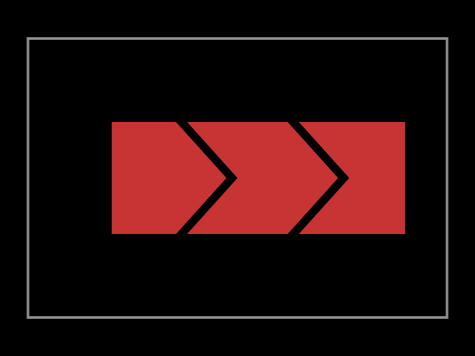

import TscircuitIframe from "@site/src/components/TscircuitIframe"

## Overview

Capacitive touch sensors replace mechanical buttons with copper shapes that detect when a finger changes their electric field. In this tutorial you will:

- Draw a capacitive electrode using `polygon` surface-mount pads.
- Connect the electrode to a capacitive touch controller.
- Route the traces, ground reference, and LED indicator for feedback.
- Simulate the PCB stackup with `tscircuit` before ordering the board.

The finished design exposes a responsive touch pad that lights an LED when it is activated.

## Bill of Materials

| Quantity | Component | Notes |
| --- | --- | --- |
| 1 | AT42QT1010 single-channel touch controller | Any capacitive-touch controller with a single key works. |
| 1 | 3.3 V regulator (or 5 V source if available) | Provides a clean supply for the controller. |
| 1 | 0603 LED + series resistor | Indicates when the sensor fires. |
| 1 | Polygon copper electrode | Created directly on the PCB. |
| Misc | Programming header, decoupling capacitors, optional guard ring | Follow the controller datasheet. |

## Step 1 – Define the Electrode Footprint

We can create a smooth, finger-sized electrode by combining polygon pads inside a reusable footprint. The code below mirrors the three overlapping electrodes used in the board preview image.

```tsx
const PolygonSmtpads = (props: { name: string }) => {
  return (
    <chip
      {...props}
      footprint={
        <footprint>
          <smtpad
            shape="polygon"
            layer="top"
            portHints={["sense"]}
            points={[
              { x: -4.5, y: 2 },
              { x: -2.2, y: 2 },
              { x: -0.4, y: 0 },
              { x: -2.2, y: -2 },
              { x: -4.5, y: -2 },
            ]}
          />

          <smtpad
            shape="polygon"
            layer="top"
            portHints={["sense"]}
            points={[
              { x: -1.8, y: 2 },
              { x: 1.8, y: 2 },
              { x: 3.6, y: 0 },
              { x: 1.8, y: -2 },
              { x: -1.8, y: -2 },
              { x: 0, y: 0 },
            ]}
          />

          <smtpad
            shape="polygon"
            layer="top"
            portHints={["sense"]}
            points={[
              { x: 2.2, y: 2 },
              { x: 6, y: 2 },
              { x: 6, y: -2 },
              { x: 2.2, y: -2 },
              { x: 4, y: 0 },
            ]}
          />
        </footprint>
      }
    />
  )
}
```

## Step 2 – Place the Board Elements

Use the custom electrode on a board and add a dedicated touch controller. The snippet below lays out the electrode, an AT42QT1010 controller, and an LED with minimal routing.

<TscircuitIframe defaultView="pcb" code={`
import { AT42QT1010 } from "@tsci/library.atmel.AT42QT1010"
import { Led0603 } from "@tsci/library.passives"

const PolygonSmtpads = (props) => (
  <chip
    {...props}
    footprint={
      <footprint>
        <smtpad shape="polygon" layer="top" portHints={["sense"]} points={[
          { x: -4.5, y: 2 },
          { x: -2.2, y: 2 },
          { x: -0.4, y: 0 },
          { x: -2.2, y: -2 },
          { x: -4.5, y: -2 },
        ]} />
        <smtpad shape="polygon" layer="top" portHints={["sense"]} points={[
          { x: -1.8, y: 2 },
          { x: 1.8, y: 2 },
          { x: 3.6, y: 0 },
          { x: 1.8, y: -2 },
          { x: -1.8, y: -2 },
          { x: 0, y: 0 },
        ]} />
        <smtpad shape="polygon" layer="top" portHints={["sense"]} points={[
          { x: 2.2, y: 2 },
          { x: 6, y: 2 },
          { x: 6, y: -2 },
          { x: 2.2, y: -2 },
          { x: 4, y: 0 },
        ]} />
      </footprint>
    }
  />
)

export default () => (
  <board width={16} height={10}>
    <PolygonSmtpads name="PAD1" pcbX={-10} pcbY={0} />
    <AT42QT1010 name="U1" pcbX={0} pcbY={0} />
    <Led0603 name="D1" pcbX={8} pcbY={-1} rotation={90} />
    <resistor name="R1" footprint="0603" pcbX={8} pcbY={2} />

    <trace from={".PAD1 .sense"} to=".U1 .SNSK" />
    <trace from=".U1 .SNS" to=".PAD1 .sense" />
    <trace from=".U1 .OUT" to=".R1 .pad2" />
    <trace from=".R1 .pad1" to=".D1 .A" />
    <trace from=".D1 .C" to="net.GND" />
    <trace from=".U1 .GND" to="net.GND" />
    <trace from=".U1 .VDD" to="net.V3V3" />
  </board>
)
`}/>

## Step 3 – Route Guard and Reference Copper

Capacitive sensors are sensitive to noise. Surround the electrode with a grounded copper pour on the bottom layer and keep the sensor trace short. If your controller supports it, add a driven shield trace between the sensor and noisy signals.

## Step 4 – Tune the Sensor

After fabricating the PCB:

1. Power the circuit and measure the idle capacitance reported by the controller.
2. Adjust sensitivity or debounce registers until a light finger touch reliably toggles the LED.
3. Test with different enclosures or overlays (e.g., acrylic, wood). Increase electrode size if the overlay is thick.

## Visualizing the Electrode Layout

The board rendering below shows how the three polygon pads create a wide, tapered sensor that guides the user toward the center.



## Next Steps

- Add multiple electrodes by duplicating `PolygonSmtpads` and using a multi-channel controller.
- Experiment with interdigitated shapes for slider widgets.
- Integrate the sensor into a custom enclosure for touch-based user interfaces.
