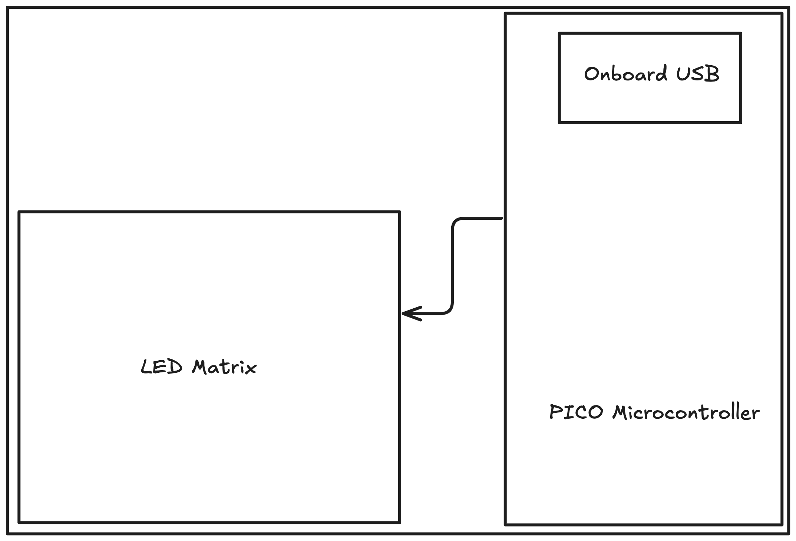

## Overview

This tutorial will walk you through building a 3x5 LED matrix controlled by a Raspberry Pi Pico using tscircuit.

import CircuitPreview from "@site/src/components/CircuitPreview"
import TscircuitIframe from "@site/src/components/TscircuitIframe"

<TscircuitIframe defaultView="3d" code={`
import { WS2812B_2020 as LedWithIc } from "@tsci/seveibar.WS2812B_2020"
import { usePICO_W } from "@tsci/seveibar.PICO_W"
import { grid } from "@tscircuit/math-utils"

type Point = { x: number; y: number }

type GridCellPositions = {
  index: number
  center: Point
  topLeft: Point
  bottomRight: Point
}

type GridOptions = {
  rows: number
  cols: number
  xSpacing?: number
  ySpacing?: number
  width?: number
  height?: number
  offsetX?: number
  offsetY?: number
  yDirection?: "cartesian" | "up-is-negative"
}

export default () => {
  const U1 = usePICO_W("U1")
  return (
    <board
      width="65mm"
      height="52mm"
      routingDisabled
    >
      <U1 pcbRotation="90deg" pcbX={-15} pcbY={0} />
      {grid({ cols: 3, rows: 5, xSpacing: 8, ySpacing: 5, offsetX: 20, offsetY: 5 }).map(
        ({ center, index }) => {
          const ledName = "LED" + (index + 1)
          const prevLedName = index > 0 ? "LED" + (index) : null
          return (
            <>
              <LedWithIc schX={center.x/2} schY={5 + center.y/2} name={ledName} pcbX={center.x} pcbY={center.y} />
              <trace from={".LED" + (index + 1) + " .GND"} to="net.GND" />
              <trace from={".LED" + (index + 1) + " .VDD"} to="net.V5" />
              {prevLedName && <trace from={".LED" + (index) + " .DO"} to={".LED" + (index + 1) + " .DI"} />}
            </>
          )
        }
      )}

      <trace from=".LED1 .DI" to={U1.GP6_SPI0SCK_I2C1SDA} />
      <trace from={U1.GND1} to="net.GND" />
      <trace from={U1.GND2} to="net.GND" />
      <trace from={U1.GND3} to="net.GND" />
      <trace from={U1.GND4} to="net.GND" />
      <trace from={U1.GND5} to="net.GND" />
      <trace from={U1.GND6} to="net.GND" />
      <trace from={U1.GND7} to="net.GND" />

      <trace from={U1.VBUS} to="net.V5" />

    </board>
  )
}

`} />

## Objectives of Building an LED Matrix

Some practical applications of building an LED Matrix include:

- **Signage** - Building signs for events, products, etc.
- **Data Visualization Tool** - Displaying real-time data metrics like GitHub contributions, website traffic, or temperature readings through color intensity
- **Interactive Notification System** - Creating a physical notification system for emails, social media, or calendar events with customizable brightness levels

## LED Matrix Requirements

- The LED matrix must be WiFi-controllable
- The matrix layout pattern must be grid-based
- Each LED should be individually controllable for brightness and color

## System Diagram

The matrix connects to the Pico microcontroller via a data chain. The Pico connects to WiFi through the `PICO_W` module.
The components and connections between them are shown in the diagram below:

## Schematic Capture

Let's import the Pico microcontroller and LED components by following the steps in the [Importing from JLCPCB](/guides/importing-modules-and-chips/importing-from-jlcpcb) section.  

We will follow the following steps to build the circuit step by step:
1. Import the Pico microcontroller Schematic
2. Import the LED Schematic
3. Chain two LEDs together
4. Chain many LEDs together
5. Connect the Pico to the LED matrix

### Pico Schematic
Schematic of the Pico microcontroller [imported from JLCPCB](/guides/importing-modules-and-chips/importing-from-jlcpcb) is shown below:
<CircuitPreview splitView={false} hidePCBTab hide3DTab defaultView="schematic" code={`
import { createUseComponent } from "@tscircuit/core"
import type { CommonLayoutProps } from "@tscircuit/props"

const pinLabels = {
  "pin1": [
    "pin1",
    "GP0_SPI0RX_I2C0SDA_UART0TX"
  ],
  "pin2": [
    "pin2",
    "GP1_SPI0CSn_I2C0SCL_UART0RX"
  ],
  "pin3": [
    "pin3",
    "GND1"
  ],
  "pin4": [
    "pin4",
    "GP2_SPI0SCK_I2C1SDA"
  ],
  "pin5": [
    "pin5",
    "GP3_SPI0TX_I2C1SCL"
  ],

  "pin6": [
    "pin6",
    "GP4_SPI0RX_I2C0SDA_UART1TX"
  ],
  "pin7": [
    "pin7",
    "GP5_SPI0CSn_I2C0SCL_UART1RX"
  ],
  "pin8": [
    "pin8",
    "GND3"
  ],
  "pin9": [
    "pin9",
    "GP6_SPI0SCK_I2C1SDA"
  ],
  "pin10": [
    "pin10",
    "GP7_SPI0TX_I2C1SCL"
  ],
  "pin11": [
    "pin11",
    "GP8_SPI1RX_I2C0SDA_UART1TX"
  ],
  "pin12": [
    "pin12",
    "GP9_SPI1CSn_I2C0SCL_UART1RX"
  ],
  "pin13": [
    "pin13",
    "GND4"
  ],
  "pin14": [
    "pin14",
    "GP10_SPI1SCK_I2C1SDA"
  ],
  "pin15": [
    "pin15",
    "GP11_SPI1TX_I2C1SCL"
  ],
  "pin16": [
    "pin16",
    "GP12_SPI1RX_I2C0SDA_UART0TX"
  ],
  "pin17": [
    "pin17",
    "GP13_SPI1CSn_I2C0SCL_UART0RX"
  ],
  "pin18": [
    "pin18",
    "GND6"
  ],
  "pin19": [
    "pin19",
    "GP14_SPI1SCK_I2C1SDA"
  ],
  "pin20": [
    "pin20",
    "GP15_SPI1TX_I2C1SCL"
  ],
  "pin21": [
    "pin21",
    "GP16_SPI0RX_UART0RX"
  ],
  "pin22": [
    "pin22",
    "GP17_SPI0CSn_UART0TX"
  ],
  "pin23": [
    "pin23",
    "GND7"
  ],
  "pin24": [
    "pin24",
    "GP18_SPI0SCK_I2C1SDA"
  ],
  "pin25": [
    "pin25",
    "GP19_SPI0TX_I2C1SCL"
  ],
  "pin26": [
    "pin26",
    "GP20_I2C0SDA"
  ],
  "pin27": [
    "pin27",
    "GP21_I2C0SCL"
  ],
  "pin28": [
    "pin28",
    "GND5"
  ],
  "pin29": [
    "pin29",
    "GP22"
  ],
  "pin30": [
    "pin30",
    "RUN"
  ],
  "pin31": [
    "pin31",
    "GP26_ADC0_I2C1SDA"
  ],
  "pin32": [
    "pin32",
    "GP27_ADC1_I2C1SCL"
  ],
  "pin33": [
    "pin33",
    "GND_AGND"
  ],
  "pin34": [
    "pin34",
    "GP28_ADC2"
  ],
  "pin35": [
    "pin35",
    "ADC_VREF"
  ],
  "pin36": [
    "pin36"
  ],
  "pin37": [
    "pin37",
    "3V3_EN"
  ],
  "pin38": [
    "pin38",
    "GND2"
  ],
  "pin39": [
    "pin39",
    "VSYS"
  ],
  "pin40": [
    "pin40",
    "VBUS"
  ],
  "pin41": [
    "pin41",
    "TP6"
  ],
  "pin42": [
    "pin42",
    "TP5"
  ],
  "pin43": [
    "pin43",
    "TP4"
  ],
  "pin44": [
    "pin44",
    "TP3"
  ],
  "pin45": [
    "pin45",
    "TP2"
  ],
  "pin46": [
    "pin46",
    "TP1"
  ]
} as const

interface Props extends CommonLayoutProps {
  name: string
}

export const PICO_W = (props: Props) => {
  return (
    <chip
      {...props}
      schWidth={5}
      cadModel={{
        objUrl: "https://modelcdn.tscircuit.com/easyeda_models/download?uuid=07c2e528ec9a4008b33211831b7000e1&pn=C7203003",
        rotationOffset: { x: 0, y: 0, z: 0 },
        positionOffset: { x: 0, y: 0, z: 0 },
      }}
      pinLabels={pinLabels}
      supplierPartNumbers={{
  "jlcpcb": [
    "C7203003"
  ]
}}
      manufacturerPartNumber="PICO_W"
      footprint={<footprint>
        <smtpad portHints={["pin41"]} pcbX="-10.940014949999977mm" pcbY="-2.499740999999972mm" width="1.499997mm" height="1.499997mm" shape="rect" />
<smtpad portHints={["pin42"]} pcbX="-13.44013695000001mm" pcbY="-2.499740999999972mm" width="1.499997mm" height="1.499997mm" shape="rect" />
<smtpad portHints={["pin43"]} pcbX="-15.940004950000002mm" pcbY="-2.499740999999972mm" width="1.499997mm" height="1.499997mm" shape="rect" />
<smtpad portHints={["pin44"]} pcbX="-24.239962950000063mm" pcbY="-0.999870999999871mm" width="1.499997mm" height="1.499997mm" shape="rect" />
<smtpad portHints={["pin45"]} pcbX="-24.239962950000063mm" pcbY="1.0001250000000255mm" width="1.499997mm" height="1.499997mm" shape="rect" />
<smtpad portHints={["pin46"]} pcbX="-20.939994949999914mm" pcbY="0.00012700000002041634mm" width="1.499997mm" height="1.499997mm" shape="rect" />
<smtpad portHints={["pin1"]} pcbX="-24.07003695000003mm" pcbY="-9.689973000000009mm" width="1.5999967999999998mm" height="3.1999935999999995mm" shape="rect" />
<smtpad portHints={["pin40"]} pcbX="-24.07003695000003mm" pcbY="9.689973000000009mm" width="1.5999967999999998mm" height="3.1999935999999995mm" shape="rect" />
<smtpad portHints={["pin2"]} pcbX="-21.530036950000067mm" pcbY="-9.689973000000009mm" width="1.5999967999999998mm" height="3.1999935999999995mm" shape="rect" />
<smtpad portHints={["pin39"]} pcbX="-21.530036950000067mm" pcbY="9.689973000000009mm" width="1.5999967999999998mm" height="3.1999935999999995mm" shape="rect" />
<smtpad portHints={["pin3"]} pcbX="-18.99003694999999mm" pcbY="-9.689973000000009mm" width="1.5999967999999998mm" height="3.1999935999999995mm" shape="rect" />
<smtpad portHints={["pin38"]} pcbX="-18.99003694999999mm" pcbY="9.689973000000009mm" width="1.5999967999999998mm" height="3.1999935999999995mm" shape="rect" />
<smtpad portHints={["pin4"]} pcbX="-16.450036950000026mm" pcbY="-9.689973000000009mm" width="1.5999967999999998mm" height="3.1999935999999995mm" shape="rect" />
<smtpad portHints={["pin37"]} pcbX="-16.450036950000026mm" pcbY="9.689973000000009mm" width="1.5999967999999998mm" height="3.1999935999999995mm" shape="rect" />
<smtpad portHints={["pin5"]} pcbX="-13.910036950000062mm" pcbY="-9.689973000000009mm" width="1.5999967999999998mm" height="3.1999935999999995mm" shape="rect" />
<smtpad portHints={["pin36"]} pcbX="-13.910036950000062mm" pcbY="9.689973000000009mm" width="1.5999967999999998mm" height="3.1999935999999995mm" shape="rect" />
<smtpad portHints={["pin6"]} pcbX="-11.370036949999985mm" pcbY="-9.689973000000009mm" width="1.5999967999999998mm" height="3.1999935999999995mm" shape="rect" />
<smtpad portHints={["pin35"]} pcbX="-11.370036949999985mm" pcbY="9.689973000000009mm" width="1.5999967999999998mm" height="3.1999935999999995mm" shape="rect" />
<smtpad portHints={["pin7"]} pcbX="-8.830036950000022mm" pcbY="-9.689973000000009mm" width="1.5999967999999998mm" height="3.1999935999999995mm" shape="rect" />
<smtpad portHints={["pin34"]} pcbX="-8.830036950000022mm" pcbY="9.689973000000009mm" width="1.5999967999999998mm" height="3.1999935999999995mm" shape="rect" />
<smtpad portHints={["pin8"]} pcbX="-6.290036950000058mm" pcbY="-9.689973000000009mm" width="1.5999967999999998mm" height="3.1999935999999995mm" shape="rect" />
<smtpad portHints={["pin33"]} pcbX="-6.290036950000058mm" pcbY="9.689973000000009mm" width="1.5999967999999998mm" height="3.1999935999999995mm" shape="rect" />
<smtpad portHints={["pin9"]} pcbX="-3.7500369499999806mm" pcbY="-9.689973000000009mm" width="1.5999967999999998mm" height="3.1999935999999995mm" shape="rect" />
<smtpad portHints={["pin32"]} pcbX="-3.7500369499999806mm" pcbY="9.689973000000009mm" width="1.5999967999999998mm" height="3.1999935999999995mm" shape="rect" />
<smtpad portHints={["pin10"]} pcbX="-1.210036950000017mm" pcbY="-9.689973000000009mm" width="1.5999967999999998mm" height="3.1999935999999995mm" shape="rect" />
<smtpad portHints={["pin31"]} pcbX="-1.210036950000017mm" pcbY="9.689973000000009mm" width="1.5999967999999998mm" height="3.1999935999999995mm" shape="rect" />
<smtpad portHints={["pin11"]} pcbX="1.3299630499999466mm" pcbY="-9.689973000000009mm" width="1.5999967999999998mm" height="3.1999935999999995mm" shape="rect" />
<smtpad portHints={["pin30"]} pcbX="1.3299630499999466mm" pcbY="9.689973000000009mm" width="1.5999967999999998mm" height="3.1999935999999995mm" shape="rect" />
<smtpad portHints={["pin12"]} pcbX="3.869963050000024mm" pcbY="-9.689973000000009mm" width="1.5999967999999998mm" height="3.1999935999999995mm" shape="rect" />
<smtpad portHints={["pin29"]} pcbX="3.869963050000024mm" pcbY="9.689973000000009mm" width="1.5999967999999998mm" height="3.1999935999999995mm" shape="rect" />
<smtpad portHints={["pin13"]} pcbX="6.409963049999988mm" pcbY="-9.689973000000009mm" width="1.5999967999999998mm" height="3.1999935999999995mm" shape="rect" />
<smtpad portHints={["pin28"]} pcbX="6.409963049999988mm" pcbY="9.689973000000009mm" width="1.5999967999999998mm" height="3.1999935999999995mm" shape="rect" />
<smtpad portHints={["pin14"]} pcbX="8.949963049999951mm" pcbY="-9.689973000000009mm" width="1.5999967999999998mm" height="3.1999935999999995mm" shape="rect" />
<smtpad portHints={["pin27"]} pcbX="8.949963049999951mm" pcbY="9.689973000000009mm" width="1.5999967999999998mm" height="3.1999935999999995mm" shape="rect" />
<smtpad portHints={["pin15"]} pcbX="11.489963049999915mm" pcbY="-9.689973000000009mm" width="1.5999967999999998mm" height="3.1999935999999995mm" shape="rect" />
<smtpad portHints={["pin26"]} pcbX="11.489963049999915mm" pcbY="9.689973000000009mm" width="1.5999967999999998mm" height="3.1999935999999995mm" shape="rect" />
<smtpad portHints={["pin16"]} pcbX="14.029963049999992mm" pcbY="-9.689973000000009mm" width="1.5999967999999998mm" height="3.1999935999999995mm" shape="rect" />
<smtpad portHints={["pin25"]} pcbX="14.029963049999992mm" pcbY="9.689973000000009mm" width="1.5999967999999998mm" height="3.1999935999999995mm" shape="rect" />
<smtpad portHints={["pin17"]} pcbX="16.569963049999956mm" pcbY="-9.689973000000009mm" width="1.5999967999999998mm" height="3.1999935999999995mm" shape="rect" />
<smtpad portHints={["pin24"]} pcbX="16.569963049999956mm" pcbY="9.689973000000009mm" width="1.5999967999999998mm" height="3.1999935999999995mm" shape="rect" />
<smtpad portHints={["pin18"]} pcbX="19.10996304999992mm" pcbY="-9.689973000000009mm" width="1.5999967999999998mm" height="3.1999935999999995mm" shape="rect" />
<smtpad portHints={["pin23"]} pcbX="19.10996304999992mm" pcbY="9.689973000000009mm" width="1.5999967999999998mm" height="3.1999935999999995mm" shape="rect" />
<smtpad portHints={["pin19"]} pcbX="21.649963049999997mm" pcbY="-9.689973000000009mm" width="1.5999967999999998mm" height="3.1999935999999995mm" shape="rect" />
<smtpad portHints={["pin22"]} pcbX="21.649963049999997mm" pcbY="9.689973000000009mm" width="1.5999967999999998mm" height="3.1999935999999995mm" shape="rect" />
<smtpad portHints={["pin20"]} pcbX="24.18996304999996mm" pcbY="-9.689973000000009mm" width="1.5999967999999998mm" height="3.1999935999999995mm" shape="rect" />
<smtpad portHints={["pin21"]} pcbX="24.18996304999996mm" pcbY="9.689973000000009mm" width="1.5999967999999998mm" height="3.1999935999999995mm" shape="rect" />
<silkscreenpath route={[{"x":17.601101449999874,"y":-10.499877399999946},{"x":18.078900849999968,"y":-10.499877399999946}]} />
<silkscreenpath route={[{"x":25.55998825000006,"y":3.5711383999999953},{"x":25.55998825000006,"y":-3.5710622000000285}]} />
<silkscreenpath route={[{"x":25.22110144999988,"y":-10.499877399999946},{"x":25.55998825000006,"y":-10.499877399999946},{"x":25.55998825000006,"y":-3.5710622000000285}]} />
<silkscreenpath route={[{"x":25.55998825000006,"y":3.5711383999999953},{"x":25.55998825000006,"y":10.500080600000047},{"x":25.22110144999988,"y":10.500080600000047}]} />
<silkscreenpath route={[{"x":-25.101048350000042,"y":10.499953600000026},{"x":-25.439808149999976,"y":10.499953600000026}]} />
<silkscreenpath route={[{"x":-25.439935149999997,"y":10.500080600000047},{"x":-25.439935149999997,"y":-10.499877399999946},{"x":-25.101099149999982,"y":-10.499877399999946}]} />
<silkscreenpath route={[{"x":-26.739830950000055,"y":3.9996363999999858},{"x":-26.339603149999903,"y":3.9996363999999858},{"x":-26.339603149999903,"y":-4.000245999999834},{"x":-26.739830950000055,"y":-4.000245999999834}]} />
<silkscreenpath route={[{"x":-26.339603149999903,"y":-3.8089332000000695},{"x":-25.465233549999994,"y":-3.8089332000000695},{"x":-25.439808149999976,"y":-3.834358599999973}]} />
<silkscreenpath route={[{"x":-26.339603149999903,"y":3.8025069999999914},{"x":-25.439808149999976,"y":3.8025069999999914}]} />
<silkscreenpath route={[{"x":-26.739830950000055,"y":3.9996363999999858},{"x":-26.739830950000055,"y":-4.000245999999834}]} />
<silkscreenpath route={[{"x":-22.561099150000132,"y":10.500080600000047},{"x":-23.03889855,"y":10.500080600000047}]} />
<silkscreenpath route={[{"x":-20.021099150000055,"y":10.500080600000047},{"x":-20.498898550000035,"y":10.500080600000047}]} />
<silkscreenpath route={[{"x":-17.48109915000009,"y":10.500080600000047},{"x":-17.95889855000007,"y":10.500080600000047}]} />
<silkscreenpath route={[{"x":-14.941099150000014,"y":10.500080600000047},{"x":-15.418898550000108,"y":10.500080600000047}]} />
<silkscreenpath route={[{"x":-12.40109915000005,"y":10.500080600000047},{"x":-12.87889855000003,"y":10.500080600000047}]} />
<silkscreenpath route={[{"x":-9.861099150000086,"y":10.500080600000047},{"x":-10.338898550000067,"y":10.500080600000047}]} />
<silkscreenpath route={[{"x":-7.321099150000123,"y":10.500080600000047},{"x":-7.79889854999999,"y":10.500080600000047}]} />
<silkscreenpath route={[{"x":-4.7810991500000455,"y":10.500080600000047},{"x":-5.258898550000026,"y":10.500080600000047}]} />
<silkscreenpath route={[{"x":-2.241099150000082,"y":10.500080600000047},{"x":-2.7188985500000626,"y":10.500080600000047}]} />
<silkscreenpath route={[{"x":0.29890084999999544,"y":10.500080600000047},{"x":-0.17889855000009902,"y":10.500080600000047}]} />
<silkscreenpath route={[{"x":2.838900849999959,"y":10.500080600000047},{"x":2.3611014499998646,"y":10.500080600000047}]} />
<silkscreenpath route={[{"x":5.378900849999923,"y":10.500080600000047},{"x":4.901101449999942,"y":10.500080600000047}]} />
<silkscreenpath route={[{"x":7.918900849999886,"y":10.500080600000047},{"x":7.441101450000019,"y":10.500080600000047}]} />
<silkscreenpath route={[{"x":10.458900849999964,"y":10.500080600000047},{"x":9.98110144999987,"y":10.500080600000047}]} />
<silkscreenpath route={[{"x":12.998900849999927,"y":10.500080600000047},{"x":12.521101449999946,"y":10.500080600000047}]} />
<silkscreenpath route={[{"x":15.538900850000005,"y":10.500080600000047},{"x":15.06110144999991,"y":10.500080600000047}]} />
<silkscreenpath route={[{"x":18.078900849999968,"y":10.500080600000047},{"x":17.601101449999874,"y":10.500080600000047}]} />
<silkscreenpath route={[{"x":20.618900849999932,"y":10.500080600000047},{"x":20.14110144999995,"y":10.500080600000047}]} />
<silkscreenpath route={[{"x":23.158900849999895,"y":10.500080600000047},{"x":22.68110145000003,"y":10.500080600000047}]} />
<silkscreenpath route={[{"x":22.68110145000003,"y":-10.499877399999946},{"x":23.158900849999895,"y":-10.499877399999946}]} />
<silkscreenpath route={[{"x":20.14110144999995,"y":-10.499877399999946},{"x":20.618900849999932,"y":-10.499877399999946}]} />
<silkscreenpath route={[{"x":15.06110144999991,"y":-10.499877399999946},{"x":15.538900850000005,"y":-10.499877399999946}]} />
<silkscreenpath route={[{"x":12.521101449999946,"y":-10.499877399999946},{"x":12.998900849999927,"y":-10.499877399999946}]} />
<silkscreenpath route={[{"x":9.98110144999987,"y":-10.499877399999946},{"x":10.458900849999964,"y":-10.499877399999946}]} />
<silkscreenpath route={[{"x":7.441101450000019,"y":-10.499877399999946},{"x":7.918900849999886,"y":-10.499877399999946}]} />
<silkscreenpath route={[{"x":4.901101449999942,"y":-10.499877399999946},{"x":5.378900849999923,"y":-10.499877399999946}]} />
<silkscreenpath route={[{"x":2.3611014499998646,"y":-10.499877399999946},{"x":2.838900849999959,"y":-10.499877399999946}]} />
<silkscreenpath route={[{"x":-0.17889855000009902,"y":-10.499877399999946},{"x":0.29890084999999544,"y":-10.499877399999946}]} />
<silkscreenpath route={[{"x":-2.7188985500000626,"y":-10.499877399999946},{"x":-2.241099150000082,"y":-10.499877399999946}]} />
<silkscreenpath route={[{"x":-5.258898550000026,"y":-10.499877399999946},{"x":-4.7810991500000455,"y":-10.499877399999946}]} />
<silkscreenpath route={[{"x":-7.79889854999999,"y":-10.499877399999946},{"x":-7.321099150000123,"y":-10.499877399999946}]} />
<silkscreenpath route={[{"x":-10.338898550000067,"y":-10.499877399999946},{"x":-9.861099150000086,"y":-10.499877399999946}]} />
<silkscreenpath route={[{"x":-12.87889855000003,"y":-10.499877399999946},{"x":-12.40109915000005,"y":-10.499877399999946}]} />
<silkscreenpath route={[{"x":-15.418898550000108,"y":-10.499877399999946},{"x":-14.941099150000014,"y":-10.499877399999946}]} />
<silkscreenpath route={[{"x":-17.95889855000007,"y":-10.499877399999946},{"x":-17.48109915000009,"y":-10.499877399999946}]} />
<silkscreenpath route={[{"x":-20.498898550000035,"y":-10.499877399999946},{"x":-20.021099150000055,"y":-10.499877399999946}]} />
<silkscreenpath route={[{"x":-23.03889855,"y":-10.499877399999946},{"x":-22.561099150000132,"y":-10.499877399999946}]} />
      </footprint>}
    />
  )
}

export const usePICO_W = createUseComponent(PICO_W, pinLabels)
`} />

### LED Schematic
We are using IC LEDs (specifically [WS2812B](https://jlcpcb.com/partdetail/Worldsemi-WS2812B2020/C965555)), which have an RGB LED and control chip integrated into the same package. These IC LEDs offer several advantages over traditional RGB LEDs:

- **Simplified Wiring** - Only 4 pins needed (VDD, GND, Data In, Data Out) compared to 4+ pins for traditional RGB LEDs
- **Serial Communication** - LEDs can be daisy-chained together, requiring only one data pin from the microcontroller
- **Individual Control** - Each LED in the chain can be controlled independently for color and brightness

<CircuitPreview splitView={false} hidePCBTab hide3DTab defaultView="schematic" code={`
import { createUseComponent } from "@tscircuit/core"
import type { CommonLayoutProps } from "@tscircuit/props"

const pinLabels = {
  "pin1": [
    "pin1",
    "DO"
  ],
  "pin2": [
    "pin2",
    "GND"
  ],
  "pin3": [
    "pin3",
    "DI"
  ],
  "pin4": [
    "pin4",
    "VDD"
  ]
} as const

interface Props extends CommonLayoutProps {
  name: string,
}

export const WS2812B_2020 = (props: Props) => {
  return (
    <chip
      {...props}
      cadModel={{
        objUrl: "https://modelcdn.tscircuit.com/easyeda_models/download?uuid=caa88715b11f4aa189b02e52bbb84e4f&pn=C965555",
        rotationOffset: { x: 0, y: 0, z: 0 },
        positionOffset: { x: 0, y: 0, z: -0.07 },
      }}
      schPortArrangement={{
        leftSide: {
          direction: "top-to-bottom",
          pins: ["DI", "GND"]
        },
        rightSide: {
          direction: "top-to-bottom",
          pins: ["VDD", "DO"]
        }
      }}
      pinLabels={pinLabels}
      supplierPartNumbers={{
  "jlcpcb": [
    "C965555"
  ]
}}
      manufacturerPartNumber="WS2812B_2020"
      footprint={<footprint>
        <smtpad portHints={["pin1"]} pcbX="-0.9150349999999889mm" pcbY="0.5500369999999748mm" width="0.8999982mm" height="0.6999986mm" shape="rect" />
<smtpad portHints={["pin2"]} pcbX="-0.9150349999999889mm" pcbY="-0.5500369999999748mm" width="0.8999982mm" height="0.6999986mm" shape="rect" />
<smtpad portHints={["pin3"]} pcbX="0.9150349999999889mm" pcbY="-0.5500369999999748mm" width="0.8999982mm" height="0.6999986mm" shape="rect" />
<smtpad portHints={["pin4"]} pcbX="0.9150349999999889mm" pcbY="0.5500369999999748mm" width="0.8999982mm" height="0.6999986mm" shape="rect" />
<silkscreenpath route={[{"x":-0.24998679999998785,"y":0.7499603999999636},{"x":-0.09999980000009145,"y":0.7499603999999636},{"x":-0.09999980000009145,"y":-0.6500114000000394},{"x":-0.09999980000009145,"y":-0.6999986000000717},{"x":-0.24998679999998785,"y":-0.6999986000000717}]} />
<silkscreenpath route={[{"x":-0.24998679999998785,"y":0.7499603999999636},{"x":-0.24998679999998785,"y":-0.7000239999999849}]} />
<silkscreenpath route={[{"x":-1.299997400000052,"y":1.1499850000000151},{"x":-1.299997400000052,"y":1.1381486000000223}]} />
<silkscreenpath route={[{"x":0.9999979999998914,"y":1.0999977999999828},{"x":-0.999998000000005,"y":1.0999977999999828}]} />
<silkscreenpath route={[{"x":-0.999998000000005,"y":-1.0999977999999828},{"x":0.9999979999998914,"y":-1.0999977999999828}]} />
      </footprint>}
    />
  )
}

export const useWS2812B_2020 = createUseComponent(WS2812B_2020, pinLabels)
`} />

### Chaining Two LEDs together

To connect two LEDs together, we need to connect the data output `DO` of the first LED to the data input `DI` of the second LED. This creates a chain of LEDs.

<CircuitPreview hidePCBTab hide3DTab defaultView="schematic" code={`
import { WS2812B_2020 as LedWithIc } from "@tsci/seveibar.WS2812B_2020"

export default () => (
  <board>
   {/* First LED */}
    <LedWithIc 
      schX={0} 
      schY={0} 
      name={"LED1"} 
    />
    {/* Second LED */}
    <LedWithIc 
      schX={5} 
      schY={0} 
      name={"LED2"} 
    />

    {/* Connecting the LEDs to GND and VDD */}
    <trace from={".LED1 .GND"} to="net.GND" />
    <trace from={".LED1 .VDD"} to="net.V5" />

    <trace from={".LED2 .GND"} to="net.GND" />
    <trace from={".LED2 .VDD"} to="net.V5" />

    {/* Connecting the LEDs together */}
    <trace from={".LED1 .DO"} to={".LED2 .DI"} />
  </board>
)
`} />

### Connecting Pico to the LED Matrix

The Pico is connected to the LED matrix via a general purpose input/output (GPIO) pin in this example we are using `GP6`,
and the other pins of the Pico are connected to ground.

<CircuitPreview hidePCBTab hide3DTab defaultView="schematic" code={`
import { usePICO_W } from "@tsci/seveibar.PICO_W"
import { WS2812B_2020 as LedWithIc } from "@tsci/seveibar.WS2812B_2020"

export default () => {
  const U1 = usePICO_W("U1")
  return (
    <board
      width="60mm"
      height="60mm"
    >
      {/* Pico microcontroller */}
      <U1 />

      {/* LED */}
      <LedWithIc 
        name={"LED1"} 
        schX={-5}
      />

      {/* Connecting the LED to GND and VDD */}
      <trace from={".LED1 .GND"} to="net.GND" />
      <trace from={".LED1 .VDD"} to="net.V5" />

      {/* Connecting the LED to the Pico GP6 pin */}
      <trace from=".LED1 .DI" to={U1.GP6_SPI0SCK_I2C1SDA} />

      {/* Connecting the Pico to GND */}
      <trace from={U1.GND1} to="net.GND" />
      <trace from={U1.GND2} to="net.GND" />
      <trace from={U1.GND3} to="net.GND" />
      <trace from={U1.GND4} to="net.GND" />
      <trace from={U1.GND5} to="net.GND" />
      <trace from={U1.GND6} to="net.GND" />
      <trace from={U1.GND7} to="net.GND" />

      {/* Connecting the Pico to the power supply */}
      <trace from={U1.VBUS} to="net.V5" />
    </board>
  )
}
`} />

### Chaining many LEDs together

#### LED Matrix Layout
We can connect multiple LEDs together by chaining them, but doing this for a large number of LEDs would be tedious.
Luckily, tscircuit has a [helper function to create a grid](https://github.com/tscircuit/math-utils) of components. We will be using that helper function to create our matrix layout.

Here we are using the [`grid`](https://github.com/tscircuit/math-utils/blob/main/src/grid.ts) function to create a 3x5 LED matrix. The `grid` function takes in the number of columns and rows, and the spacing between the components.

<CircuitPreview hidePCBTab hide3DTab defaultView="schematic" code={`
import { WS2812B_2020 as LedWithIc } from "@tsci/seveibar.WS2812B_2020"
import { grid } from "@tscircuit/math-utils"

export default () => {
  return (
    <board width="65mm" height="52mm" routingDisabled>
      {/* 3x5 LED matrix */}
      {grid({ cols: 3, rows: 5, xSpacing: 8, ySpacing: 5, offsetX: 20, offsetY: 5 }).map(
        ({ center, index }) => {
          const ledName = "LED" + (index + 1)
          const prevLedName = index > 0 ? "LED" + (index) : null
          return (
            <>
              {/* LED */}
              <LedWithIc schX={center.x/2} schY={5 + center.y/2} name={ledName} />

              {/* Connecting the LED to GND and VDD */}
              <trace from={".LED" + (index + 1) + " .GND"} to="net.GND" />
              <trace from={".LED" + (index + 1) + " .VDD"} to="net.V5" />

              {/* Connecting the LED to the previous LED */}
              {prevLedName && <trace from={".LED" + (index) + " .DO"} to={".LED" + (index + 1) + " .DI"} />}
            </>
          )
        }
      )}
    </board>
  )
}
`}
/>

### Connecting the Pico to the LED matrix

Here we are merging all the learnings from the previous examples to create a complete circuit. The Pico is connected to the LED matrix via the `GP6` pin, and the other pins of the Pico are connected to ground.
The `GP6` pin is connected to the data input `DI` of the first LED, and the data output `DO` of each LED is connected to the data input `DI` of the next LED in the chain.
While connecting the LEDs together, we are also connecting the `GND` and `VDD` pins of the LEDs to ground and 5V supply respectively.

Complete circuit is shown below:

<CircuitPreview hidePCBTab hide3DTab defaultView="schematic" code={`
import { usePICO_W } from "@tsci/seveibar.PICO_W"
import { WS2812B_2020 as LedWithIc } from "@tsci/seveibar.WS2812B_2020"
import { grid } from "@tscircuit/math-utils"

export default () => {
  const U1 = usePICO_W("U1")
  return (  
    <board width="60mm" height="60mm" routingDisabled>
      {/* Pico microcontroller */}
      <U1 />

      {/* LED matrix */}
      {grid({ cols: 3, rows: 5, xSpacing: 8, ySpacing: 5, offsetX: 20 }).map(
        ({ center, index }) => {
          const ledName = "LED" + (index + 1)
          const prevLedName = index > 0 ? "LED" + (index) : null
          return (
            <>
              {/* LED */}
              <LedWithIc schX={center.x/2} schY={5 + center.y/2} name={ledName} />

              {/* Connecting the LED to GND and VDD */}
              <trace from={".LED" + (index + 1) + " .GND"} to="net.GND" />
              <trace from={".LED" + (index + 1) + " .VDD"} to="net.V5" />

              {/* Connecting the LED to the previous LED */}
              {prevLedName && <trace from={".LED" + (index) + " .DO"} to={".LED" + (index + 1) + " .DI"} />}
            </>
          )
        }
      )}

      {/* Connecting the Pico to the LED matrix using GP6 pin */}
      <trace from={U1.GP6_SPI0SCK_I2C1SDA} to={".LED1 .DI"} />

      {/* Connecting the Pico to GND */}
      <trace from={U1.GND1} to="net.GND" />
      <trace from={U1.GND2} to="net.GND" />
      <trace from={U1.GND3} to="net.GND" />
      <trace from={U1.GND4} to="net.GND" />
      <trace from={U1.GND5} to="net.GND" />
      <trace from={U1.GND6} to="net.GND" />
      <trace from={U1.GND7} to="net.GND" />
    </board>
  )
}
`} />

## PCB Layout

We can translate our schematic into a PCB layout by specifying the physical positions of components on the board.

Here we are adding the positions of the components on the PCB:
- Pico microcontroller is added at `pcbX={-15} pcbY={0}` with a rotation of `90deg` (Rotation is needed for the Pico to be in the correct orientation)
- LEDs are added at positions calculated by the grid function with a spacing of `8mm` horizontally and `5mm` vertically

<CircuitPreview  hide3DTab defaultView="pcb" code={`
import { usePICO_W } from "@tsci/seveibar.PICO_W"
import { WS2812B_2020 as LedWithIc } from "@tsci/seveibar.WS2812B_2020"
import { grid } from "@tscircuit/math-utils"

export default () => {
  const U1 = usePICO_W("U1")
  return (  
    <board width="65mm" height="60mm" routingDisabled>
      {/* Pico microcontroller */}
      <U1 pcbRotation="90deg" pcbX={-15} pcbY={0} />

      {/* LED matrix */}
      {grid({ cols: 3, rows: 5, xSpacing: 8, ySpacing: 5, offsetX: 20, offsetY: 5 }).map(
        ({ center, index }) => {
          const ledName = "LED" + (index + 1)
          const prevLedName = index > 0 ? "LED" + (index) : null
          return (
            <>
              {/* LED */}
              <LedWithIc schX={center.x/2} schY={5 + center.y/2} name={ledName} pcbX={center.x} pcbY={center.y} />

              {/* Connecting the LED to GND and VDD */}
              <trace from={".LED" + (index + 1) + " .GND"} to="net.GND" />
              <trace from={".LED" + (index + 1) + " .VDD"} to="net.V5" />

              {/* Connecting the LED to the previous LED */}
              {prevLedName && <trace from={".LED" + (index) + " .DO"} to={".LED" + (index + 1) + " .DI"} />}
            </>
          )
        }
      )}

      {/* Connecting the Pico to the LED matrix using GP6 pin */}
      <trace from={U1.GP6_SPI0SCK_I2C1SDA} to={".LED1 .DI"} />

      {/* Connecting the Pico to GND */}
      <trace from={U1.GND1} to="net.GND" />
      <trace from={U1.GND2} to="net.GND" />
      <trace from={U1.GND3} to="net.GND" />
      <trace from={U1.GND4} to="net.GND" />
      <trace from={U1.GND5} to="net.GND" />
      <trace from={U1.GND6} to="net.GND" />
      <trace from={U1.GND7} to="net.GND" />
    </board>
  )
}
`} />

Check out this circuit in our [Playground](https://tscircuit.com/editor?snippet_id=e30ad928-3432-49a4-826c-f50cae1490ef).

## Ordering the PCB

You can order this PCB by downloading the fabrication files and uploading them to JLCPCB. Follow the instructions from [here](/building-electronics/ordering-prototypes).

## Controlling the LED Matrix

The LED matrix can be controlled through a simple web interface that provides a visual grid for controlling individual LEDs. The control system includes:

<table>
  <tr>
    <td>
      
    </td>
    <td>
      
    </td>
  </tr>
</table>

1. **Web Interface**: A 3x5 grid interface where clicking each cell cycles through:
   - Off (Gray)
   - Red
   - Green
   - Blue

2. **API Integration**: The matrix state can be controlled and monitored through REST endpoints, making it easy to integrate with other applications.

3. **Pico W Connection**: The matrix connects to WiFi using the Pico W's wireless capabilities, allowing for remote control through the web interface.

The complete implementation, including the web interface and Pico W code, is available in our [LED Matrix Server repository](https://github.com/tscircuit/led-matrix-server).
