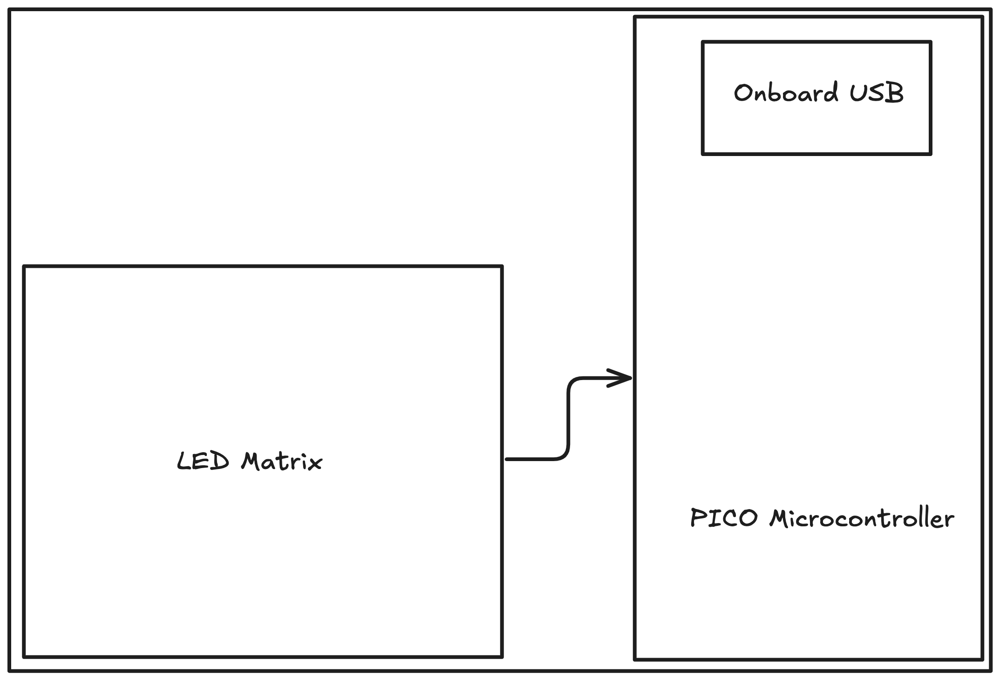
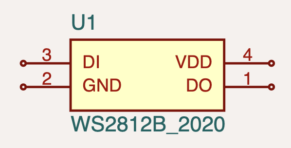

## Overview

This tutorial will walk you through building a 3x5 LED matrix controlled by a Raspberry Pi Pico using tscircuit.

import CircuitPreview from "@site/src/components/CircuitPreview"
import TscircuitIframe from "@site/src/components/TscircuitIframe"

<TscircuitIframe defaultView="3d" code={`
import { WS2812B_2020 as LedWithIc } from "@tsci/seveibar.WS2812B_2020"
import { usePICO_W } from "@tsci/seveibar.PICO_W"
import { grid } from "@tscircuit/math-utils"

type Point = { x: number; y: number }

type GridCellPositions = {
  index: number
  center: Point
  topLeft: Point
  bottomRight: Point
}

type GridOptions = {
  rows: number
  cols: number
  xSpacing?: number
  ySpacing?: number
  width?: number
  height?: number
  offsetX?: number
  offsetY?: number
  yDirection?: "cartesian" | "up-is-negative"
}

export default () => {
  const U1 = usePICO_W("U1")
  return (
    <board
      width="65mm"
      height="52mm"
      routingDisabled
    >
      <U1 pcbRotation="90deg" pcbX={-15} pcbY={0} />
      {grid({ cols: 3, rows: 5, xSpacing: 8, ySpacing: 5, offsetX: 20, offsetY: 5 }).map(
        ({ center, index }) => {
          const ledName = "LED" + (index + 1)
          const prevLedName = index > 0 ? "LED" + (index) : null
          return (
            <>
              <LedWithIc schX={center.x/2} schY={5 + center.y/2} name={ledName} pcbX={center.x} pcbY={center.y} />
              <trace from={".LED" + (index + 1) + " .GND"} to="net.GND" />
              <trace from={".LED" + (index + 1) + " .VDD"} to="net.V5" />
              {prevLedName && <trace from={".LED" + (index) + " .DO"} to={".LED" + (index + 1) + " .DI"} />}
            </>
          )
        }
      )}

      <trace from=".LED1 .DI" to={U1.GP6_SPI0SCK_I2C1SDA} />
      <trace from={U1.GND1} to="net.GND" />
      <trace from={U1.GND2} to="net.GND" />
      <trace from={U1.GND3} to="net.GND" />
      <trace from={U1.GND4} to="net.GND" />
      <trace from={U1.GND5} to="net.GND" />
      <trace from={U1.GND6} to="net.GND" />
      <trace from={U1.GND7} to="net.GND" />

      <trace from={U1.VBUS} to="net.V5" />

    </board>
  )
}

`} />

## Objectives of Building a LED Matrix

Some of the practical applications of building an LED Matrix are:

- **Signage** - Build signs for events, products, etc.
- **Data Visualization Tool** - Display real-time data metrics like GitHub contributions, website traffic, or temperature readings through color intensity
- **Interactive Notification System** - Create a physical notification system for emails, social media, or calendar events with customizable brightness levels

## LED Matrix Requirements

- We want the LED matrix to be WiFi controllable
- We want to be able to control the brightness and color of each LED
- Matrix layout pattern should be grid-based

## Introduction

In this tutorial, we'll build a circuit consisting of:
- A 3x5 matrix of LEDs (we've kept it simple for this tutorial)
- A WiFi-enabled Raspberry Pi Pico microcontroller

The final circuit will have the LEDs arranged in a grid pattern, with data being chained through each LED.

## System Diagram

The matrix is connected to the Pico microcontroller via a data chain. The Pico is connected to WiFi via the `PICO_W` module.

Components and connections between them are shown in the diagram below:

## LED Matrix Layout

There are multiple ways to arrange LEDs in a matrix. We will be using a **grid pattern** in this tutorial.
The reason for this is that it is the most commonly used layout and makes it easier to create patterns and animations because of the dense nature of the grid.

Luckily, tscircuit has a helper function to create a grid of components. We will be using that helper function to create our matrix layout.

:::note
This helper method can be imported from the [`math-utils`](https://github.com/tscircuit/math-utils) library
:::

## Schematic Capture

We can import the Pico microcontroller and LED by following the steps as mentioned in the [Importing from jlcpcb](/guides/importing-modules-and-chips/importing-from-jlcpcb) section.

<figure>

<figcaption>Pico microcontroller schematic</figcaption>
</figure>

<figure>

<figcaption>LED schematic</figcaption>
</figure>

### Example of two LEDs connected together

These are IC LEDs, which have the RGB LED and the control chip integrated in the same package. 
To connect two LEDs together, we need to connect the data output `DO` of the first LED to the data input `DI` of the second LED. This creates a chain of LEDs.

<CircuitPreview defaultView="schematic" code={`
import { WS2812B_2020 as LedWithIc } from "@tsci/seveibar.WS2812B_2020"

export default () => (
  <board>
    <LedWithIc 
      schX={0} 
      schY={0} 
      name={"LED1"} 
    />
    <LedWithIc 
      schX={5} 
      schY={0} 
      name={"LED2"} 
    />

    <trace from={".LED1 .GND"} to="net.GND" />
    <trace from={".LED1 .VDD"} to="net.V5" />

    <trace from={".LED2 .GND"} to="net.GND" />
    <trace from={".LED2 .VDD"} to="net.V5" />

    <trace from={".LED1 .DO"} to={".LED2 .DI"} />
  </board>
)
`} />

### Example of connecting Pico to the LED

The Pico is connected to the LED via the `GP6` pin, and the other pins of the Pico are connected to ground.

<CircuitPreview defaultView="schematic" code={`
import { usePICO_W } from "@tsci/seveibar.PICO_W"
import { WS2812B_2020 as LedWithIc } from "@tsci/seveibar.WS2812B_2020"

export default () => {
  const U1 = usePICO_W("U1")
  return (
    <board
      width="60mm"
      height="60mm"
    >
      <U1 />

      <LedWithIc 
        name={"LED1"} 
        schX={-5}
      />

      <trace from={".LED1 .GND"} to="net.GND" />
      <trace from={".LED1 .VDD"} to="net.V5" />

      <trace from=".LED1 .DI" to={U1.GP6_SPI0SCK_I2C1SDA} />
      <trace from={U1.GND1} to="net.GND" />
      <trace from={U1.GND2} to="net.GND" />
      <trace from={U1.GND3} to="net.GND" />
      <trace from={U1.GND4} to="net.GND" />
      <trace from={U1.GND5} to="net.GND" />
      <trace from={U1.GND6} to="net.GND" />
      <trace from={U1.GND7} to="net.GND" />

      <trace from={U1.VBUS} to="net.V5" />
    </board>
  )
}
`} />

### Connecting multiple LEDs together

We can connect multiple LEDs together by chaining them, but doing this for a large number of LEDs would be tedious.
Luckily, tscircuit has a helper function to create a grid of components. We will be using that helper function to create our matrix layout.

:::note
This helper method can be imported from the [`math-utils`](https://github.com/tscircuit/math-utils) library
:::

<CircuitPreview defaultView="schematic" code={`
import { WS2812B_2020 as LedWithIc } from "@tsci/seveibar.WS2812B_2020"
import { grid } from "@tscircuit/math-utils"

export default () => {
  const cells = grid({ cols: 3, rows: 5, xSpacing: 8, ySpacing: 5, offsetX: 3 })
  return (
    <board width="65mm" height="52mm" routingDisabled>
      {grid({ cols: 3, rows: 5, xSpacing: 8, ySpacing: 5, offsetX: 20, offsetY: 5 }).map(
        ({ center, index }) => {
          const ledName = "LED" + (index + 1)
          const prevLedName = index > 0 ? "LED" + (index) : null
          return (
            <>
              <LedWithIc schX={center.x/2} schY={5 + center.y/2} name={ledName} />
              <trace from={".LED" + (index + 1) + " .GND"} to="net.GND" />
              <trace from={".LED" + (index + 1) + " .VDD"} to="net.V5" />
              {prevLedName && <trace from={".LED" + (index) + " .DO"} to={".LED" + (index + 1) + " .DI"} />}
            </>
          )
        }
      )}
    </board>
  )
}
`}
/>

### Connecting the Pico to the LED matrix

Here we are merging all the learnings from the previous examples to create a complete circuit. The Pico is connected to the LED matrix via the `GP6` pin, and the other pins of the Pico are connected to ground.
The `GP6` pin is connected to the data input `DI` of the first LED, and the data output `DO` of each LED is connected to the data input `DI` of the next LED in the chain.
While connecting the LEDs together, we are also connecting the `GND` and `VDD` pins of the LEDs to ground and 5V supply respectively.

Complete circuit is shown below:

<CircuitPreview defaultView="schematic" code={`
import { usePICO_W } from "@tsci/seveibar.PICO_W"
import { WS2812B_2020 as LedWithIc } from "@tsci/seveibar.WS2812B_2020"
import { grid } from "@tscircuit/math-utils"

export default () => {
  const U1 = usePICO_W("U1")
  return (  
    <board width="60mm" height="60mm" routingDisabled>
      {/* Pico microcontroller */}
      <U1 />

      {/* LED matrix */}
      {grid({ cols: 3, rows: 5, xSpacing: 8, ySpacing: 5, offsetX: 20, offsetY: 5 }).map(
        ({ center, index }) => {
          const ledName = "LED" + (index + 1)
          const prevLedName = index > 0 ? "LED" + (index) : null
          return (
            <>
              <LedWithIc schX={center.x/2} schY={5 + center.y/2} name={ledName} />
              <trace from={".LED" + (index + 1) + " .GND"} to="net.GND" />
              <trace from={".LED" + (index + 1) + " .VDD"} to="net.V5" />
              {prevLedName && <trace from={".LED" + (index) + " .DO"} to={".LED" + (index + 1) + " .DI"} />}
            </>
          )
        }
      )}

      <trace from={U1.GP6_SPI0SCK_I2C1SDA} to={".LED1 .DI"} />
      <trace from={U1.GND1} to="net.GND" />
      <trace from={U1.GND2} to="net.GND" />
      <trace from={U1.GND3} to="net.GND" />
      <trace from={U1.GND4} to="net.GND" />
      <trace from={U1.GND5} to="net.GND" />
      <trace from={U1.GND6} to="net.GND" />
      <trace from={U1.GND7} to="net.GND" />
    </board>
  )
}
`} />

## PCB Layout

We can use the same circuit to create a PCB layout, and add the positions of the components on the PCB.

Here we are adding the positions of the components on the PCB:
- Pico microcontroller is added at `pcbX={-15} pcbY={0}` with a rotation of `90deg` (Rotation is needed for the Pico to be in the correct orientation)
- LEDs are added at positions calculated by the grid function with a spacing of `8mm` horizontally and `5mm` vertically

<CircuitPreview defaultView="pcb" code={`
import { usePICO_W } from "@tsci/seveibar.PICO_W"
import { WS2812B_2020 as LedWithIc } from "@tsci/seveibar.WS2812B_2020"
import { grid } from "@tscircuit/math-utils"

export default () => {
  const U1 = usePICO_W("U1")
  return (  
    <board width="65mm" height="60mm" routingDisabled>
      {/* Pico microcontroller */}
      <U1 pcbRotation="90deg" pcbX={-15} pcbY={0} />

      {/* LED matrix */}
      {grid({ cols: 3, rows: 5, xSpacing: 8, ySpacing: 5, offsetX: 20, offsetY: 5 }).map(
        ({ center, index }) => {
          const ledName = "LED" + (index + 1)
          const prevLedName = index > 0 ? "LED" + (index) : null
          return (
            <>
              <LedWithIc schX={center.x/2} schY={5 + center.y/2} name={ledName} pcbX={center.x} pcbY={center.y} />
              <trace from={".LED" + (index + 1) + " .GND"} to="net.GND" />
              <trace from={".LED" + (index + 1) + " .VDD"} to="net.V5" />
              {prevLedName && <trace from={".LED" + (index) + " .DO"} to={".LED" + (index + 1) + " .DI"} />}
            </>
          )
        }
      )}

      <trace from={U1.GP6_SPI0SCK_I2C1SDA} to={".LED1 .DI"} />
      <trace from={U1.GND1} to="net.GND" />
      <trace from={U1.GND2} to="net.GND" />
      <trace from={U1.GND3} to="net.GND" />
      <trace from={U1.GND4} to="net.GND" />
      <trace from={U1.GND5} to="net.GND" />
      <trace from={U1.GND6} to="net.GND" />
      <trace from={U1.GND7} to="net.GND" />
    </board>
  )
}
`} />

Check out this circuit in our [Playground](https://tscircuit.com/editor?snippet_id=e30ad928-3432-49a4-826c-f50cae1490ef).

## Ordering the PCB

You can order this PCB by downloading the fabrication files and uploading them to JLCPCB. Follow the instructions from [here](/building-electronics/ordering-prototypes).