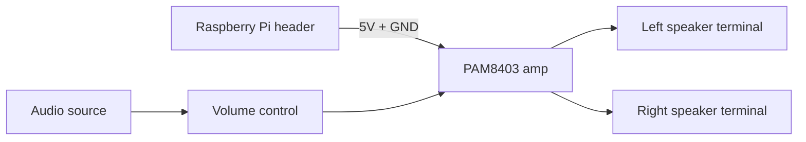

## Overview

This tutorial shows how to build a compact stereo audio HAT for a Raspberry Pi
using a PAM8403-style class D amplifier. The design includes:

- stereo line-level input
- a simple volume control path
- two speaker terminals
- decoupling and shutdown wiring for a stable 5V board

import CircuitPreview from "@site/src/components/CircuitPreview"

## Why Class D?

Class D amplifiers are efficient because their output stage switches rapidly
rather than running in a linear mode. For a small HAT, that matters:

- less heat
- better battery-friendly behavior
- easy 5V power from the Pi header
- plenty of power for small speakers

The PAM8403 class is a good fit for compact stereo builds because it is small,
cheap, and practical for short speaker runs.

## Circuit Requirements

For this tutorial, the HAT needs to:

- accept stereo line input
- provide volume control before amplification
- drive left and right speakers from separate outputs
- stay powered from the Raspberry Pi 5V rail

## Step 1: Place the HAT and amplifier

We start with the Raspberry Pi HAT board and the amplifier core.

<CircuitPreview splitView={false} hidePCBTab hide3DTab defaultView="schematic" code={`
import { RaspberryPiHatBoard } from "@tscircuit/common"

export default () => (
  <RaspberryPiHatBoard name="HAT1">
    <chip
      name="U1"
      footprint="ssop16"
      manufacturerPartNumber="PAM8403"
      pinLabels={{
        pin1: "VDD",
        pin2: "L_IN",
        pin3: "R_IN",
        pin4: "GND",
        pin5: "L_OUT_P",
        pin6: "L_OUT_N",
        pin7: "R_OUT_P",
        pin8: "R_OUT_N",
        pin9: "SHDN",
        pin10: "GAIN1",
        pin11: "GAIN2",
        pin12: "BYPASS",
        pin13: "NC1",
        pin14: "NC2",
        pin15: "NC3",
        pin16: "NC4",
      }}
      pcbX={0}
      pcbY={0}
    />

    <trace from=".U1 .VDD" to=".HAT1_chip .V5_1" />
    <trace from=".U1 .GND" to=".HAT1_chip .GND_1" />
    <trace from=".U1 .SHDN" to=".HAT1_chip .V5_2" />
  </RaspberryPiHatBoard>
`}/>

## Step 2: Add input connectors and volume control

The input side is intentionally simple. Each stereo channel gets its own
potentiometer so both channels stay balanced.

<CircuitPreview splitView={false} hidePCBTab hide3DTab defaultView="schematic" code={`
import { RaspberryPiHatBoard } from "@tscircuit/common"

export default () => (
  <RaspberryPiHatBoard name="HAT1">
    <chip
      name="U1"
      footprint="ssop16"
      manufacturerPartNumber="PAM8403"
      pinLabels={{
        pin1: "VDD",
        pin2: "L_IN",
        pin3: "R_IN",
        pin4: "GND",
        pin5: "L_OUT_P",
        pin6: "L_OUT_N",
        pin7: "R_OUT_P",
        pin8: "R_OUT_N",
        pin9: "SHDN",
        pin10: "GAIN1",
        pin11: "GAIN2",
        pin12: "BYPASS",
        pin13: "NC1",
        pin14: "NC2",
        pin15: "NC3",
        pin16: "NC4",
      }}
      pcbX={0}
      pcbY={0}
    />

    <connector
      name="J_IN"
      footprint="pinrow3"
      pinLabels={{
        pin1: "L_IN",
        pin2: "GND",
        pin3: "R_IN",
      }}
      pcbX={-24}
      pcbY={0}
    />

    <potentiometer
      name="RV1"
      maxResistance="10k"
      pinVariant="three_pin"
      footprint="pinrow3"
      pcbX={-12}
      pcbY={8}
    />

    <potentiometer
      name="RV2"
      maxResistance="10k"
      pinVariant="three_pin"
      footprint="pinrow3"
      pcbX={-12}
      pcbY={-8}
    />

    <trace from=".J_IN .L_IN" to=".RV1 .pin1" />
    <trace from=".RV1 .pin2" to=".U1 .L_IN" />
    <trace from=".RV1 .pin3" to="net.GND" />

    <trace from=".J_IN .R_IN" to=".RV2 .pin1" />
    <trace from=".RV2 .pin2" to=".U1 .R_IN" />
    <trace from=".RV2 .pin3" to="net.GND" />

    <trace from=".J_IN .GND" to="net.GND" />
    <trace from=".U1 .VDD" to=".HAT1_chip .V5_1" />
    <trace from=".U1 .GND" to=".HAT1_chip .GND_1" />
    <trace from=".U1 .SHDN" to=".HAT1_chip .V5_2" />
  </RaspberryPiHatBoard>
`}/>

## Step 3: Add speaker terminals

The amplifier outputs are routed to separate left and right speaker terminals.
Keep these traces short and away from the input path.

<CircuitPreview splitView={false} hidePCBTab hide3DTab defaultView="schematic" code={`
import { RaspberryPiHatBoard } from "@tscircuit/common"

export default () => (
  <RaspberryPiHatBoard name="HAT1">
    <chip
      name="U1"
      footprint="ssop16"
      manufacturerPartNumber="PAM8403"
      pinLabels={{
        pin1: "VDD",
        pin2: "L_IN",
        pin3: "R_IN",
        pin4: "GND",
        pin5: "L_OUT_P",
        pin6: "L_OUT_N",
        pin7: "R_OUT_P",
        pin8: "R_OUT_N",
        pin9: "SHDN",
        pin10: "GAIN1",
        pin11: "GAIN2",
        pin12: "BYPASS",
        pin13: "NC1",
        pin14: "NC2",
        pin15: "NC3",
        pin16: "NC4",
      }}
      pcbX={0}
      pcbY={0}
    />

    <connector
      name="J_SPK_L"
      footprint="pinrow2"
      pinLabels={{
        pin1: "SPK_L_P",
        pin2: "SPK_L_N",
      }}
      pcbX={-24}
      pcbY={12}
    />

    <connector
      name="J_SPK_R"
      footprint="pinrow2"
      pinLabels={{
        pin1: "SPK_R_P",
        pin2: "SPK_R_N",
      }}
      pcbX={-24}
      pcbY={-12}
    />

    <trace from=".U1 .L_OUT_P" to=".J_SPK_L .SPK_L_P" />
    <trace from=".U1 .L_OUT_N" to=".J_SPK_L .SPK_L_N" />
    <trace from=".U1 .R_OUT_P" to=".J_SPK_R .SPK_R_P" />
    <trace from=".U1 .R_OUT_N" to=".J_SPK_R .SPK_R_N" />

    <trace from=".U1 .VDD" to=".HAT1_chip .V5_1" />
    <trace from=".U1 .GND" to=".HAT1_chip .GND_1" />
    <trace from=".U1 .SHDN" to=".HAT1_chip .V5_2" />
  </RaspberryPiHatBoard>
`}/>

## Step 4: Add decoupling

Class D stages are sensitive to supply noise. A small bulk capacitor plus a
small ceramic capacitor near the amplifier helps keep the rail stable.

<CircuitPreview splitView={false} hidePCBTab hide3DTab defaultView="schematic" code={`
import { RaspberryPiHatBoard } from "@tscircuit/common"

export default () => (
  <RaspberryPiHatBoard name="HAT1">
    <chip
      name="U1"
      footprint="ssop16"
      manufacturerPartNumber="PAM8403"
      pinLabels={{
        pin1: "VDD",
        pin2: "L_IN",
        pin3: "R_IN",
        pin4: "GND",
        pin5: "L_OUT_P",
        pin6: "L_OUT_N",
        pin7: "R_OUT_P",
        pin8: "R_OUT_N",
        pin9: "SHDN",
        pin10: "GAIN1",
        pin11: "GAIN2",
        pin12: "BYPASS",
        pin13: "NC1",
        pin14: "NC2",
        pin15: "NC3",
        pin16: "NC4",
      }}
      pcbX={0}
      pcbY={0}
    />

    <capacitor name="C1" capacitance="10uF" footprint="1206" pcbX={14} pcbY={8} />
    <capacitor name="C2" capacitance="100nF" footprint="0402" pcbX={14} pcbY={2} />

    <trace from=".U1 .VDD" to=".C1 .pin1" />
    <trace from=".C1 .pin2" to="net.GND" />
    <trace from=".U1 .VDD" to=".C2 .pin1" />
    <trace from=".C2 .pin2" to="net.GND" />

    <trace from=".U1 .SHDN" to=".HAT1_chip .V5_1" />
    <trace from=".U1 .GND" to=".HAT1_chip .GND_1" />
  </RaspberryPiHatBoard>
`}/>

## Step 5: Place the PCB

For a HAT, aim to keep the board within the standard footprint and place the
speaker connectors near the edge. The amplifier should sit close to the
terminal outputs, and the input path should stay on the opposite side.

<CircuitPreview hide3DTab defaultView="pcb" code={`
import { RaspberryPiHatBoard } from "@tscircuit/common"

export default () => (
  <RaspberryPiHatBoard name="HAT1">
    <chip
      name="U1"
      footprint="ssop16"
      manufacturerPartNumber="PAM8403"
      pcbX={0}
      pcbY={0}
      pinLabels={{
        pin1: "VDD",
        pin2: "L_IN",
        pin3: "R_IN",
        pin4: "GND",
        pin5: "L_OUT_P",
        pin6: "L_OUT_N",
        pin7: "R_OUT_P",
        pin8: "R_OUT_N",
        pin9: "SHDN",
        pin10: "GAIN1",
        pin11: "GAIN2",
        pin12: "BYPASS",
        pin13: "NC1",
        pin14: "NC2",
        pin15: "NC3",
        pin16: "NC4",
      }}
    />

    <connector
      name="J_IN"
      footprint="pinrow3"
      pinLabels={{
        pin1: "L_IN",
        pin2: "GND",
        pin3: "R_IN",
      }}
      pcbX={-24}
      pcbY={0}
    />

    <connector
      name="J_SPK_L"
      footprint="pinrow2"
      pinLabels={{
        pin1: "SPK_L_P",
        pin2: "SPK_L_N",
      }}
      pcbX={-24}
      pcbY={12}
    />

    <connector
      name="J_SPK_R"
      footprint="pinrow2"
      pinLabels={{
        pin1: "SPK_R_P",
        pin2: "SPK_R_N",
      }}
      pcbX={-24}
      pcbY={-12}
    />

    <potentiometer name="RV1" maxResistance="10k" pinVariant="three_pin" footprint="pinrow3" pcbX={-10} pcbY={8} />
    <potentiometer name="RV2" maxResistance="10k" pinVariant="three_pin" footprint="pinrow3" pcbX={-10} pcbY={-8} />
    <capacitor name="C1" capacitance="10uF" footprint="1206" pcbX={14} pcbY={8} />
    <capacitor name="C2" capacitance="100nF" footprint="0402" pcbX={14} pcbY={2} />
  </RaspberryPiHatBoard>
`}/>

## Raspberry Pi integration

The HAT itself is just the amplifier and support parts. In practice you will
feed it from a line-level audio source:

- a Raspberry Pi with audio enabled
- a small external DAC
- a USB audio adapter

Once the Pi is outputting audio, wire the left and right channels into the
input connector and set the volume with the potentiometers on the HAT.

On Raspberry Pi OS, the usual setup is:

1. pick the correct audio output in system settings
2. set a sensible mixer level in `alsamixer`
3. keep the master volume near the middle before tuning the hardware pots

If you are using a DAC add-on instead of onboard audio, configure that device
first, then feed its line output into `J_IN`.

## Audio configuration guide

For a clean first power-up:

1. start with the volume pots turned down
2. power the HAT from a current-limited bench supply or the Pi itself
3. verify that `VDD` is close to 5V
4. confirm that the amplifier stays enabled through `SHDN`
5. connect a small speaker first, then raise the volume slowly

If you hear distortion early, reduce the gain or lower the source level before
touching the hardware wiring.

## Ordering the PCB

After the schematic and layout look right, generate fabrication files and send
them to your PCB house of choice. A 5V class D HAT is a good candidate for a
small two-layer board with short, direct speaker routes.

## Next steps

- add reverse-polarity protection on the 5V input
- add a mute switch to the shutdown line
- add mounting holes aligned to the HAT outline
- add a silkscreen legend for the speaker terminals
