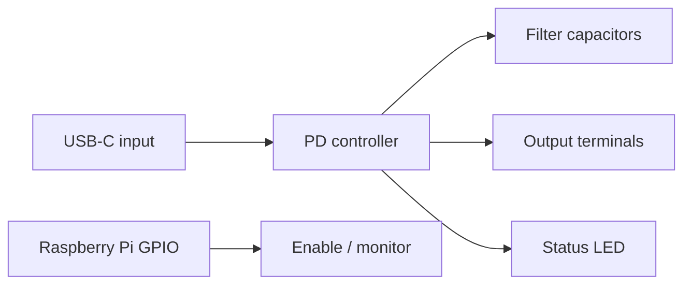

## Overview

This tutorial shows how to build a compact USB Power Delivery trigger HAT. The
board takes power from a USB-C source, negotiates a target voltage, and routes
the result to screw-terminal style outputs for downstream electronics.

import CircuitPreview from "@site/src/components/CircuitPreview"



## Why a USB PD trigger board?

USB Power Delivery makes it easy to get a clean regulated rail without a
separate DC adapter for every voltage. A trigger board is useful when you want
to:

- power a bench project from a USB-C brick
- switch between common rails like 5V, 9V, 12V, 15V, and 20V
- keep the output in a small board that is easy to mount or prototype

The key is to keep the control path simple and the power path short.

## Circuit Requirements

For this tutorial, the HAT needs to:

- accept USB-C power input
- negotiate one of several fixed PD voltages
- expose the output on screw terminals
- show an active status LED
- include filtering capacitors near the controller and output rails

## Step 1: Place the USB-C input and controller

We start with a Raspberry Pi HAT outline, a USB-C input connector, and a PD
controller block.

<CircuitPreview splitView={false} hidePCBTab hide3DTab defaultView="schematic" code={`
import { RaspberryPiHatBoard } from "@tscircuit/common"

export default () => (
  <RaspberryPiHatBoard name="HAT1">
    <connector
      name="J_USB"
      standard="usb_c"
      pinLabels={{
        pin1: "VCC",
        pin2: "D_NEG",
        pin3: "D_POS",
        pin4: "GND",
      }}
      pcbX={-24}
      pcbY={0}
    />

    <chip
      name="U1"
      footprint="ssop16"
      manufacturerPartNumber="CH224K"
      pinLabels={{
        pin1: "VBUS",
        pin2: "CC1",
        pin3: "CC2",
        pin4: "GND",
        pin5: "EN",
        pin6: "SEL0",
        pin7: "SEL1",
        pin8: "PG",
        pin9: "OUT",
        pin10: "SENSE",
        pin11: "NC1",
        pin12: "NC2",
        pin13: "NC3",
        pin14: "NC4",
        pin15: "NC5",
        pin16: "NC6",
      }}
      pcbX={0}
      pcbY={0}
    />

    <trace from=".J_USB .VCC" to=".U1 .VBUS" />
    <trace from=".J_USB .GND" to=".U1 .GND" />
    <trace from=".U1 .CC1" to=".J_USB .D_NEG" />
    <trace from=".U1 .CC2" to=".J_USB .D_POS" />
    <trace from=".U1 .EN" to=".HAT1_chip .GPIO_18" />
  </RaspberryPiHatBoard>
`}/>

## Step 2: Add the voltage select header

The controller is configured with a small preset header. In a real board, this
would be matched to the controller's resistor table or strap options for the
target voltage.

<CircuitPreview splitView={false} hidePCBTab hide3DTab defaultView="schematic" code={`
import { RaspberryPiHatBoard } from "@tscircuit/common"

export default () => (
  <RaspberryPiHatBoard name="HAT1">
    <connector
      name="J_USB"
      standard="usb_c"
      pinLabels={{
        pin1: "VCC",
        pin2: "D_NEG",
        pin3: "D_POS",
        pin4: "GND",
      }}
      pcbX={-24}
      pcbY={0}
    />

    <chip
      name="U1"
      footprint="ssop16"
      manufacturerPartNumber="CH224K"
      pinLabels={{
        pin1: "VBUS",
        pin2: "CC1",
        pin3: "CC2",
        pin4: "GND",
        pin5: "EN",
        pin6: "SEL0",
        pin7: "SEL1",
        pin8: "PG",
        pin9: "OUT",
        pin10: "SENSE",
        pin11: "NC1",
        pin12: "NC2",
        pin13: "NC3",
        pin14: "NC4",
        pin15: "NC5",
        pin16: "NC6",
      }}
      pcbX={0}
      pcbY={0}
    />

    <connector
      name="J_VSEL"
      footprint="pinrow5"
      pinLabels={{
        pin1: "5V",
        pin2: "9V",
        pin3: "12V",
        pin4: "15V",
        pin5: "20V",
      }}
      pcbX={10}
      pcbY={10}
    />

    <trace from=".U1 .SEL0" to=".J_VSEL .5V" />
    <trace from=".U1 .SEL1" to=".J_VSEL .9V" />
    <trace from=".U1 .EN" to=".HAT1_chip .GPIO_18" />
    <trace from=".U1 .VBUS" to=".J_USB .VCC" />
    <trace from=".U1 .GND" to=".J_USB .GND" />
  </RaspberryPiHatBoard>
`}/>

## Step 3: Add output terminals and status LED

Once the controller negotiates successfully, the selected rail is sent to the
output block and the status LED lights up.

<CircuitPreview splitView={false} hidePCBTab hide3DTab defaultView="schematic" code={`
import { RaspberryPiHatBoard } from "@tscircuit/common"

export default () => (
  <RaspberryPiHatBoard name="HAT1">
    <connector
      name="J_USB"
      standard="usb_c"
      pinLabels={{
        pin1: "VCC",
        pin2: "D_NEG",
        pin3: "D_POS",
        pin4: "GND",
      }}
      pcbX={-24}
      pcbY={0}
    />

    <chip
      name="U1"
      footprint="ssop16"
      manufacturerPartNumber="CH224K"
      pinLabels={{
        pin1: "VBUS",
        pin2: "CC1",
        pin3: "CC2",
        pin4: "GND",
        pin5: "EN",
        pin6: "SEL0",
        pin7: "SEL1",
        pin8: "PG",
        pin9: "OUT",
        pin10: "SENSE",
        pin11: "NC1",
        pin12: "NC2",
        pin13: "NC3",
        pin14: "NC4",
        pin15: "NC5",
        pin16: "NC6",
      }}
      pcbX={0}
      pcbY={0}
    />

    <connector
      name="J_OUT"
      footprint="pinrow2"
      pinLabels={{
        pin1: "VOUT",
        pin2: "GND",
      }}
      pcbX={24}
      pcbY={0}
    />

    <led name="D1" color="green" pcbX={10} pcbY={-10} />
    <resistor name="R1" resistance="1k" footprint="0402" pcbX={6} pcbY={-10} />

    <trace from=".U1 .OUT" to=".J_OUT .VOUT" />
    <trace from=".U1 .GND" to=".J_OUT .GND" />
    <trace from=".U1 .PG" to=".R1 .pin1" />
    <trace from=".R1 .pin2" to=".D1 .pin1" />
    <trace from=".D1 .pin2" to=".U1 .GND" />
    <trace from=".U1 .VBUS" to=".J_USB .VCC" />
    <trace from=".J_USB .GND" to=".U1 .GND" />
  </RaspberryPiHatBoard>
`}/>

## Step 4: Add filtering capacitors

Keep the input and output rails calm with one bulk capacitor and one small
ceramic capacitor close to the controller.

<CircuitPreview splitView={false} hidePCBTab hide3DTab defaultView="schematic" code={`
import { RaspberryPiHatBoard } from "@tscircuit/common"

export default () => (
  <RaspberryPiHatBoard name="HAT1">
    <connector
      name="J_USB"
      standard="usb_c"
      pinLabels={{
        pin1: "VCC",
        pin2: "D_NEG",
        pin3: "D_POS",
        pin4: "GND",
      }}
      pcbX={-24}
      pcbY={0}
    />

    <chip
      name="U1"
      footprint="ssop16"
      manufacturerPartNumber="CH224K"
      pinLabels={{
        pin1: "VBUS",
        pin2: "CC1",
        pin3: "CC2",
        pin4: "GND",
        pin5: "EN",
        pin6: "SEL0",
        pin7: "SEL1",
        pin8: "PG",
        pin9: "OUT",
        pin10: "SENSE",
        pin11: "NC1",
        pin12: "NC2",
        pin13: "NC3",
        pin14: "NC4",
        pin15: "NC5",
        pin16: "NC6",
      }}
      pcbX={0}
      pcbY={0}
    />

    <capacitor name="C1" capacitance="47uF" footprint="1206" pcbX={12} pcbY={8} />
    <capacitor name="C2" capacitance="100nF" footprint="0402" pcbX={12} pcbY={2} />

    <trace from=".U1 .VBUS" to=".C1 .pin1" />
    <trace from=".C1 .pin2" to=".U1 .GND" />
    <trace from=".U1 .VBUS" to=".C2 .pin1" />
    <trace from=".C2 .pin2" to=".U1 .GND" />
    <trace from=".U1 .VBUS" to=".J_USB .VCC" />
    <trace from=".J_USB .GND" to=".U1 .GND" />
  </RaspberryPiHatBoard>
`}/>

## Step 5: Show the PCB placement

The USB-C connector belongs near the edge. The controller should stay close to
the input, while the output terminals sit on the opposite side for shorter
power paths.

<CircuitPreview hide3DTab defaultView="pcb" code={`
import { RaspberryPiHatBoard } from "@tscircuit/common"

export default () => (
  <RaspberryPiHatBoard name="HAT1">
    <connector
      name="J_USB"
      standard="usb_c"
      pinLabels={{
        pin1: "VCC",
        pin2: "D_NEG",
        pin3: "D_POS",
        pin4: "GND",
      }}
      pcbX={-24}
      pcbY={0}
    />

    <chip
      name="U1"
      footprint="ssop16"
      manufacturerPartNumber="CH224K"
      pcbX={0}
      pcbY={0}
      pinLabels={{
        pin1: "VBUS",
        pin2: "CC1",
        pin3: "CC2",
        pin4: "GND",
        pin5: "EN",
        pin6: "SEL0",
        pin7: "SEL1",
        pin8: "PG",
        pin9: "OUT",
        pin10: "SENSE",
        pin11: "NC1",
        pin12: "NC2",
        pin13: "NC3",
        pin14: "NC4",
        pin15: "NC5",
        pin16: "NC6",
      }}
    />

    <connector
      name="J_VSEL"
      footprint="pinrow5"
      pinLabels={{
        pin1: "5V",
        pin2: "9V",
        pin3: "12V",
        pin4: "15V",
        pin5: "20V",
      }}
      pcbX={10}
      pcbY={10}
    />

    <connector
      name="J_OUT"
      footprint="pinrow2"
      pinLabels={{
        pin1: "VOUT",
        pin2: "GND",
      }}
      pcbX={24}
      pcbY={0}
    />

    <led name="D1" color="green" pcbX={10} pcbY={-10} />
    <resistor name="R1" resistance="1k" footprint="0402" pcbX={6} pcbY={-10} />
    <capacitor name="C1" capacitance="47uF" footprint="1206" pcbX={12} pcbY={8} />
    <capacitor name="C2" capacitance="100nF" footprint="0402" pcbX={12} pcbY={2} />
  </RaspberryPiHatBoard>
`}/>

## Bill of Materials

| Ref | Part | Notes |
| --- | --- | --- |
| U1 | USB PD controller | A CH224K / FP28XX / PD2001-style trigger controller |
| J_USB | USB-C connector | Input power source |
| J_OUT | Terminal block | Output rail and ground |
| J_VSEL | Preset header | Voltage selection table |
| D1 | Status LED | Shows negotiated power-good state |
| R1 | LED resistor | Typical 1k current limit |
| C1 | Bulk capacitor | Smooths output transients |
| C2 | Ceramic capacitor | High-frequency decoupling |

## Testing Procedures

Before you rely on the board, test it in this order:

1. verify the USB-C source is current-limited
2. confirm the selected voltage on the output terminals with a meter
3. check that the status LED turns on only after negotiation
4. try a small load first, then increase current gradually
5. move through the supported voltage presets one at a time

If the output is unstable, reduce load current and inspect the wiring around the
controller and the output connector.

## Example Code

If you wire the controller's enable or status signal to a Raspberry Pi GPIO,
you can monitor the board from Python:

```python
import time
import RPi.GPIO as GPIO

ENABLE_PIN = 18
STATUS_PIN = 23

GPIO.setmode(GPIO.BCM)
GPIO.setup(ENABLE_PIN, GPIO.OUT, initial=GPIO.LOW)
GPIO.setup(STATUS_PIN, GPIO.IN)

GPIO.output(ENABLE_PIN, GPIO.HIGH)
time.sleep(1)

print("power good:", bool(GPIO.input(STATUS_PIN)))

GPIO.cleanup()
```

## Ordering the PCB

Once the schematic and placement look right, generate fabrication files and
send them to your PCB manufacturer. Keep the high-current routing short and the
USB input path clean.

## Next Steps

- add a load switch so the output can be enabled from software
- add an inline current monitor
- support a second output rail
- add mounting holes for enclosure integration
